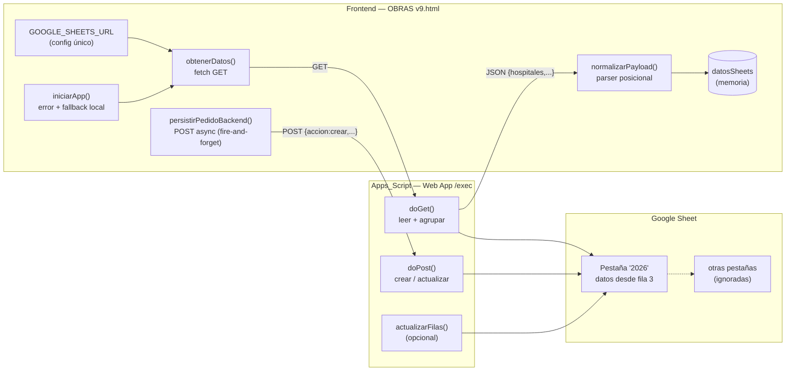
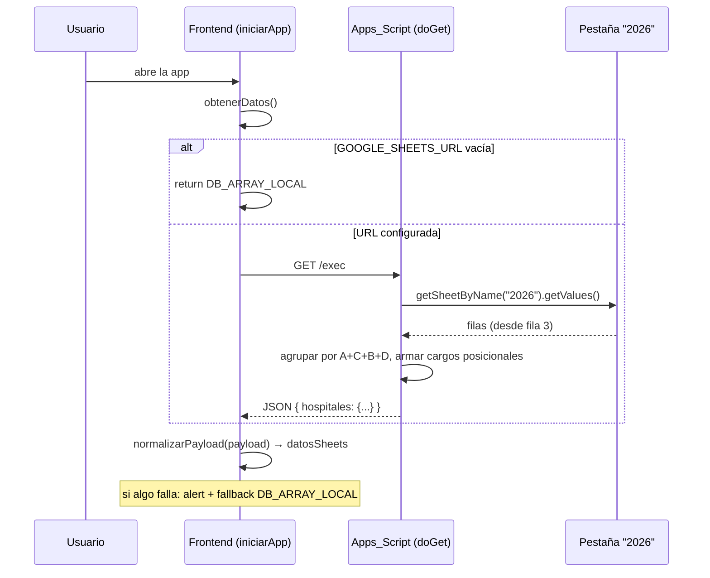

# Design Document — Conexión Google Sheets

## Overview

Esta feature conecta la app de seguimiento de pedidos (`OBRAS v9.html`, archivo único HTML+CSS+JS vanilla) a un Google Sheet real mediante un Google Apps Script publicado como Web App. El diseño respeta dos restricciones estructurales que no cambian:

1. **El contrato de datos es inmutable.** El JSON de lectura y el orden posicional del array `cargo` (10 elementos) que hoy consume `normalizarPayload` se conservan tal cual. El backend debe emitir exactamente ese formato.
2. **Los puntos de integración del Frontend se preservan.** La constante `GOOGLE_SHEETS_URL` sigue siendo el único punto de configuración (Requirement 1) y `persistirPedidoBackend(hospital, pedido)` mantiene su firma de dos parámetros (Requirement 4.1).

El trabajo se entrega en dos partes:

- **(A) Apps Script** — código nuevo (`doGet`, `doPost`, y opcionalmente `actualizarFilas`) que se pega en el editor de Apps Script del documento y se publica como Web App. Expone una URL `/exec`.
- **(B) Frontend** — cambios mínimos en el HTML: implementar el POST asíncrono dentro de `persistirPedidoBackend` (y, como extensión opcional, el gancho de actualización). La lectura por `fetch` y el manejo de error de lectura **ya están implementados** (ver Arquitectura).

Toda lectura, escritura y actualización ocurre **exclusivamente sobre la pestaña "2026"** del documento (Requirements 2.3, 4.5, 7.2). Cualquier otra pestaña se ignora.

### Estado actual vs. trabajo a realizar

| Pieza | Estado | Requisito |
|---|---|---|
| Constante `GOOGLE_SHEETS_URL` | **Existe** (vacía por defecto) | R1 |
| Lectura GET en `obtenerDatos()` | **Existe** | R2.1 |
| `normalizarPayload()` (parser posicional) | **Existe** | R2.6, R2.7, R6.4 |
| Manejo de error de lectura + fallback a `DB_ARRAY_LOCAL` | **Existe** en `iniciarApp()` | R3.1, R3.2 |
| Recorte visual " - PROYECTO" (`nombreEfectorDisplay`) | **Existe** | R6.5 |
| Card espejo de RESUELTOS | **Existe** (`entrarHospital`/`armarCardPedido`) | R6.6 |
| `doGet` (Apps Script) | **A construir** | R2, R6 |
| `doPost` acción "crear" (Apps Script) | **A construir** | R4 |
| POST asíncrono en `persistirPedidoBackend` | **A construir** | R4, R5 |
| `actualizarFilas` (Apps Script) + gancho Frontend | **Opcional / extensión futura** | R7 |

## Architecture

### Diagrama de componentes



### Flujo de lectura (Requirements 2, 3)



### Flujo de escritura (Requirements 4, 5)

```mermaid
sequenceDiagram
    participant U as Usuario
    participant G as guardarNuevoPedido()
    participant P as persistirPedidoBackend()
    participant A as Apps_Script (doPost)
    participant S as Pestaña "2026"

    U->>G: GUARDAR pedido
    G->>G: datosSheets[hospital].push(pedido)  (memoria PRIMERO)
    G->>P: persistirPedidoBackend(hospital, pedido)  (sin await)
    Note over G: la UI continúa; no bloquea
    P->>A: POST /exec { accion:"crear", hospital, pedido }<br/>Content-Type: text/plain;charset=utf-8
    A->>S: appendRow() por cada cargo
    S-->>A: ok
    A-->>P: { ok:true, filas:N }
    alt éxito
        P->>P: console.log(filas)
    else error (resp no ok / data.ok !== true / red)
        P->>U: alert (el pedido YA está en memoria)
    end
```

### Decisión de diseño: CORS y `text/plain`

Apps Script no responde el preflight `OPTIONS` que dispara un POST con `Content-Type: application/json`. Enviar el body como `text/plain;charset=utf-8` (Requirement 4.4) evita el preflight: el navegador lo trata como "simple request" y va directo al POST. El body sigue siendo un string JSON; en el backend se parsea con `JSON.parse(e.postData.contents)`. Es el patrón estándar y probado para Apps Script Web Apps.

### Decisión de diseño: fire-and-forget en la escritura

`guardarNuevoPedido` persiste en memoria **antes** de llamar a `persistirPedidoBackend` (Requirement 5.1) y **no** usa `await` sobre ella. Así la UI nunca se bloquea ni pierde el pedido si el Sheet falla (Requirement 5.4). `persistirPedidoBackend` es `async` internamente y gestiona su propio éxito/error (console.log / alert), pero el llamador la invoca como fire-and-forget para mantener la firma y el comportamiento no bloqueante.

## Components and Interfaces

### Frontend

| Función | Firma | Cambio | Responsabilidad |
|---|---|---|---|
| `obtenerDatos` | `async () => payload` | ninguno | GET a la URL o devolver `DB_ARRAY_LOCAL` |
| `normalizarPayload` | `(payload) => {hosp: [...]}` | ninguno | Parsear formato posicional a objetos |
| `iniciarApp` | `async () => void` | ninguno | Orquesta carga + error + fallback |
| `nombreEfectorDisplay` | `(nombre) => string` | ninguno | Recorte visual " - PROYECTO" (R6.5) |
| `persistirPedidoBackend` | `(hospital, pedido) => void` (async por dentro) | **implementar POST** | Enviar pedido nuevo al backend |

### Apps Script (Web App)

| Función | Firma | Responsabilidad |
|---|---|---|
| `doGet` | `(e) => ContentService.TextOutput` | Leer pestaña "2026", agrupar, devolver Payload_Lectura |
| `doPost` | `(e) => ContentService.TextOutput` | Rutear por `accion`; "crear" inserta filas |
| `getHoja2026_` | `() => Sheet` (helper) | `getSheetByName("2026")`; lanza si es null |
| `actualizarFilas` | `(hospital, denom, escalafon, puesto, idxCargo, campos) => {...}` | **Opcional** (R7) |

## Data Models

### Contrato de datos

### Contrato_Cargo (array posicional de 10 — inmutable)

El corazón del contrato. `normalizarPayload` lo consume con estos índices exactos:

| Índice | Campo | Tipo en JSON | Origen columna Sheet |
|---|---|---|---|
| 0 | `tipoQ` | string | H (TIPO DE Q) |
| 1 | `escalafon` | string | I (ESCALAFON) |
| 2 | `puesto` | string | J (PUESTO NUEVO) |
| 3 | `qPlan` | number/string | K (Q planificado) |
| 4 | `canal` | string | L (CANAL SOLICITUD) |
| 5 | `qPedido` | number/string | P (Q PEDIDO) |
| 6 | `expediente` | string | Q (Expediente) |
| 7 | `qAprobado` | number/string | R (Q APROBADO HACIENDA) |
| 8 | `validado` | `0 | 1` | N (VALIDADO SSAH) |
| 9 | `resuelto` | `0 | 1` | S (RESUELTO) |

En lectura, `validado`/`resuelto` son enteros `0|1`; `normalizarPayload` los convierte a booleanos (`c[8] === 1`). En escritura, el `pedido` de memoria trae `validado`/`resuelto` como booleanos y el backend los escribe como booleanos en las columnas N/S.

### Payload_Lectura (salida de `doGet`)

```json
{
  "hospitales": {
    "<Nombre Hospital tal cual col A>": [
      [
        "<tipo>", "<detalle>", "<fecha>", "<prioridad>",
        [
          ["tipoQ","escalafon","puesto",qPlan,"canal",qPedido,"expediente",qAprobado, validado0o1, resuelto0o1]
        ]
      ]
    ]
  }
}
```

Cada **Pedido** es el array posicional `[tipo, detalle, fecha, prioridad, cargos]` (Requirements 6.1, 6.2). `grupos` y `catalogos` son opcionales y solo se incluyen si existen datos (Requirement 6.3) — en la versión inicial de `doGet` no se emiten.

### Payload_Escritura (entrada de `doPost`)

```json
{
  "accion": "crear",
  "hospital": "<Nombre tal cual, sin normalizar>",
  "pedido": {
    "tipo": "...", "detalle": "...", "fecha": "...",
    "prioridad": "DESPRIORIZADO" | "-",
    "cargos": [
      { "tipoQ":"...", "escalafon":"...", "puesto":"...", "qPlan":..., "canal":"...",
        "qPedido":..., "expediente":"...", "qAprobado":..., "validado":true|false, "resuelto":true|false }
    ]
  }
}
```

### Mapeo de columnas de la Pestaña "2026" (0-based)

Datos desde la **fila 3** (índice `i=2` en el array de `getValues()`). Filas 1 y 2 son encabezados (Requirement 2.4).

| Idx | Col | Encabezado | Lectura (doGet) | Escritura (doPost crear) |
|---|---|---|---|---|
| 0 | A | HOSPITALES | clave de agrupación + nombre | `hospital` |
| 1 | B | TIPO | `tipo` del pedido | `pedido.tipo` |
| 2 | C | DENOMINACION | `detalle` + clave agrup. | `pedido.detalle` |
| 3 | D | OBRA FECHA FIN | `fecha` + clave agrup. | `pedido.fecha` |
| 4 | E | CATEGORIA | — | `''` |
| 5 | F | EJERCICIO PRESUP | — | `''` |
| 6 | G | PRIORIZACION MSGC | → `prioridad` | `"despriorizado"` o `''` |
| 7 | H | TIPO DE Q | `cargo[0]` | `cargo.tipoQ` |
| 8 | I | ESCALAFON | `cargo[1]` | `cargo.escalafon` |
| 9 | J | PUESTO NUEVO | `cargo[2]` | `cargo.puesto` |
| 10 | K | Q (planificado) | `cargo[3]` | `cargo.qPlan` |
| 11 | L | CANAL SOLICITUD | `cargo[4]` | `cargo.canal` |
| 12 | M | Validar DG | — | `false` |
| 13 | N | VALIDADO SSAH | `cargo[8]` (0/1) | `cargo.validado` (bool) |
| 14 | O | PEDIDO A HACIENDA | — | `''` |
| 15 | P | Q PEDIDO | `cargo[5]` | `cargo.qPedido` |
| 16 | Q | Expediente | `cargo[6]` | `cargo.expediente` |
| 17 | R | Q APROBADO HACIENDA | `cargo[7]` | `cargo.qAprobado` |
| 18 | S | RESUELTO | `cargo[9]` (0/1) | `cargo.resuelto` (bool) |
| 19 | T | ESTADO | — | `''` |
| 20 | U | OBSERVACION | — | `''` |
| 21 | V | (vacía) | — | `''` |
| 22 | W | cuenta resueltos | — | `''` |
| 23 | X | Looker Plani | — | `''` |

Notas del contrato:

- **Nombre del hospital sin normalizar** en ambos sentidos (Requirements 2.9, 4.6). El recorte " - PROYECTO" es solo visual en el Frontend (Requirement 6.5).
- **`prioridad`** en lectura: `"DESPRIORIZADO"` si `String(colG).toLowerCase() === "despriorizado"`, si no `"-"` (Requirement 2.8). En escritura: col G recibe `"despriorizado"` si `pedido.prioridad === "DESPRIORIZADO"`, si no `''`.
- **`validado`/`resuelto`** en lectura: `1` si col N/S es `TRUE` (booleano nativo o texto `"TRUE"`), si no `0`.
- **Cargos resueltos NO se duplican.** El backend solo informa `resuelto` 0/1; la card espejo del filtro RESUELTOS la arma el Frontend por su cuenta (Requirement 6.6).

## Diseño detallado

### `getHoja2026_()` — helper de acceso a la pestaña (Requirements 2.3, 4.5, 7.2)

```javascript
// Devuelve la pestaña "2026" o lanza un error claro si no existe.
// TODAS las operaciones (doGet/doPost/actualizarFilas) pasan por aquí.
function getHoja2026_() {
  var hoja = SpreadsheetApp.getActiveSpreadsheet().getSheetByName("2026");
  if (!hoja) {
    throw new Error('No se encontró la pestaña "2026" en el documento.');
  }
  return hoja;
}
```

### `doGet(e)` — lectura y agrupación (Requirements 2, 6)

Pseudocódigo / implementación:

```javascript
function doGet(e) {
  try {
    var hoja = getHoja2026_();                 // R2.3 — pestaña por nombre exacto
    var filas = hoja.getDataRange().getValues(); // matriz 0-based
    var hospitales = {};
    var mapaPedidos = {};                       // clave -> referencia al pedido (array posicional)

    // Datos desde la fila 3 => índice i = 2. Filas 0 y 1 son encabezados (R2.4).
    for (var i = 2; i < filas.length; i++) {
      var f = filas[i];
      var hospital = f[0];                      // col A
      if (hospital === "" || hospital == null) continue; // saltear filas sin hospital

      var tipo    = f[1];                       // B
      var detalle = f[2];                       // C
      var fecha   = f[3];                       // D
      // R2.8 — prioridad
      var prioridad = (String(f[6]).toLowerCase() === "despriorizado") ? "DESPRIORIZADO" : "-";

      // R2.7 — Contrato_Cargo posicional (10). validado/resuelto -> 0|1 (R col N/S).
      var validado = esVerdadero_(f[13]) ? 1 : 0;   // N
      var resuelto = esVerdadero_(f[18]) ? 1 : 0;   // S
      var cargo = [
        f[7],   // 0 tipoQ       (H)
        f[8],   // 1 escalafon   (I)
        f[9],   // 2 puesto      (J)
        f[10],  // 3 qPlan       (K)
        f[11],  // 4 canal       (L)
        f[15],  // 5 qPedido     (P)
        f[16],  // 6 expediente  (Q)
        f[17],  // 7 qAprobado   (R)
        validado, // 8           (N)
        resuelto  // 9           (S)
      ];

      // R2.5 — agrupar por HOSPITAL(A) + DENOMINACION(C) + TIPO(B) + FECHA(D)
      var clave = hospital + "||" + detalle + "||" + tipo + "||" + fecha;
      if (!mapaPedidos[clave]) {
        var pedido = [tipo, detalle, fecha, prioridad, []]; // Pedido posicional
        mapaPedidos[clave] = pedido;
        if (!hospitales[hospital]) hospitales[hospital] = []; // R2.9 — nombre tal cual
        hospitales[hospital].push(pedido);
      }
      mapaPedidos[clave][4].push(cargo);        // R2.6 — cada fila -> un cargo
    }

    return jsonOut_({ hospitales: hospitales }); // grupos/catalogos opcionales (R6.3): no se emiten
  } catch (err) {
    return jsonOut_({ ok: false, error: String(err.message || err) });
  }
}

// Interpreta TRUE booleano nativo o texto "TRUE" (case-insensitive) como verdadero.
function esVerdadero_(v) {
  if (v === true) return true;
  return String(v).trim().toLowerCase() === "true";
}

function jsonOut_(obj) {
  return ContentService
    .createTextOutput(JSON.stringify(obj))
    .setMimeType(ContentService.MimeType.JSON);
}
```

### `doPost(e)` — escritura (Requirements 4, 5)

```javascript
function doPost(e) {
  try {
    var body = JSON.parse(e.postData.contents); // body llega como text/plain (R4.4)
    var accion = body.accion;

    if (accion === "crear") {
      var filas = crearFilas_(body.hospital, body.pedido); // R4.5
      return jsonOut_({ ok: true, filas: filas });         // R4.8
    }

    // Extensión opcional (R7)
    if (accion === "actualizar") {
      var r = actualizarFilas(body.hospital, body.denominacion,
                              body.escalafon, body.puesto, body.idxCargo, body.campos);
      return jsonOut_({ ok: true, actualizado: r });
    }

    return jsonOut_({ ok: false, error: "Acción no reconocida: " + accion });
  } catch (err) {
    return jsonOut_({ ok: false, error: String(err.message || err) });
  }
}

// Inserta una fila por cada cargo (R4.5). Devuelve la cantidad de filas escritas.
function crearFilas_(hospital, pedido) {
  var hoja = getHoja2026_();
  var prioriG = (pedido.prioridad === "DESPRIORIZADO") ? "despriorizado" : "";
  var cargos = pedido.cargos || [];
  cargos.forEach(function (c) {
    // Orden de columnas A..X según el mapeo. R4.6 — hospital sin normalizar.
    hoja.appendRow([
      hospital,        // A
      pedido.tipo,     // B
      pedido.detalle,  // C
      pedido.fecha,    // D
      "",              // E CATEGORIA
      "",              // F EJERCICIO PRESUP
      prioriG,         // G PRIORIZACION MSGC
      c.tipoQ,         // H
      c.escalafon,     // I
      c.puesto,        // J
      c.qPlan,         // K
      c.canal,         // L
      false,           // M Validar DG
      c.validado,      // N VALIDADO SSAH (bool)
      "",              // O PEDIDO A HACIENDA
      c.qPedido,       // P
      c.expediente,    // Q
      c.qAprobado,     // R
      c.resuelto,      // S RESUELTO (bool)
      "", "", "", "", ""  // T..X
    ]);
  });
  return cargos.length;
}
```

### `persistirPedidoBackend(hospital, pedido)` — Frontend (Requirements 4, 5)

Reemplaza el no-op actual. Mantiene **firma de 2 parámetros** (R4.1). Es `async` por dentro pero el llamador la invoca **sin `await`** (fire-and-forget). El pedido ya fue guardado en memoria antes de esta llamada (R5.1), por eso ante error solo se avisa.

```javascript
async function persistirPedidoBackend(hospital, pedido) {
  if (!GOOGLE_SHEETS_URL) return;              // R1.2 — sin backend, no-op silencioso
  try {
    const resp = await fetch(GOOGLE_SHEETS_URL, {
      method: "POST",
      headers: { "Content-Type": "text/plain;charset=utf-8" }, // R4.4 — evita preflight CORS
      body: JSON.stringify({ accion: "crear", hospital: hospital, pedido: pedido }) // R4.2, R4.3
    });
    if (!resp.ok) throw new Error("HTTP " + resp.status);
    const data = await resp.json();
    if (!data || data.ok !== true) throw new Error((data && data.error) || "Respuesta inválida del Sheets");
    console.log("Pedido sincronizado con el Sheets. Filas insertadas: " + data.filas); // R5.2
  } catch (e) {
    // R5.3 / R5.4 — el pedido YA está en memoria; solo avisamos.
    alert("El pedido se guardó localmente, pero no se pudo sincronizar con el Sheets (" + e.message + ").");
  }
}
```

El llamador en `guardarNuevoPedido` **no cambia** (ya persiste en memoria antes y llama sin await):

```javascript
if (!datosSheets[hospital]) datosSheets[hospital] = [];
datosSheets[hospital].push(pedido);   // R5.1 — memoria primero
persistirPedidoBackend(hospital, pedido); // fire-and-forget
```

### `actualizarFilas(...)` — extensión futura OPCIONAL (Requirement 7)

No se implementa en la entrega inicial. Documentado para referencia. Ubica la fila por HOSPITAL(A) + DENOMINACION(C) + ESCALAFON(I) + PUESTO(J) más el índice del cargo dentro de ese grupo, y modifica **solo** las columnas editables N, P, R, S (1-based: N=14, P=16, R=18, S=19).

```javascript
// OPCIONAL — extensión futura (R7). No forma parte de la entrega inicial.
function actualizarFilas(hospital, denominacion, escalafon, puesto, idxCargo, campos) {
  var hoja = getHoja2026_();
  var filas = hoja.getDataRange().getValues();
  var vistos = 0;
  for (var i = 2; i < filas.length; i++) {
    var f = filas[i];
    if (f[0] === hospital && f[2] === denominacion && f[8] === escalafon && f[9] === puesto) {
      if (vistos === idxCargo) {
        var fila1based = i + 1;
        // Solo columnas editables (R7.2)
        if (campos.validado !== undefined) hoja.getRange(fila1based, 14).setValue(campos.validado); // N
        if (campos.qPedido  !== undefined) hoja.getRange(fila1based, 16).setValue(campos.qPedido);  // P
        if (campos.qAprobado!== undefined) hoja.getRange(fila1based, 18).setValue(campos.qAprobado);// R
        if (campos.resuelto !== undefined) hoja.getRange(fila1based, 19).setValue(campos.resuelto); // S
        return true;
      }
      vistos++;
    }
  }
  return false;
}
```

## Correctness Properties

*Una property es una característica o comportamiento que debe cumplirse en todas las ejecuciones válidas del sistema; es una afirmación formal sobre lo que el sistema debe hacer. Las properties son el puente entre la especificación legible por humanos y las garantías de correctitud verificables por máquina.*

El núcleo testeable de esta feature son las **transformaciones puras** de datos entre las filas del Sheet y el contrato JSON (agrupación, mapeo posicional, reglas de `prioridad`/`validado`/`resuelto`). El I/O real de Sheets (`getValues`, `appendRow`) se prueba con integración/mocks (ver Testing Strategy). Las properties usan un **mock del Sheet** (una matriz en memoria) para aislar la lógica del I/O.

### Property 1: Round-trip de lectura preserva los cargos

*Para toda* matriz de filas válida de la pestaña "2026" (desde la fila 3), al pasarla por `doGet` y luego por `normalizarPayload`, cada cargo reconstruido coincide campo a campo con la fila original en el orden posicional del Contrato_Cargo `[tipoQ, escalafon, puesto, qPlan, canal, qPedido, expediente, qAprobado, validado, resuelto]`.

**Validates: Requirements 2.4, 2.6, 2.7, 2.10, 6.1, 6.2, 6.4**

### Property 2: Agrupación por clave compuesta

*Para toda* matriz de filas, dos filas quedan en el mismo Pedido si y solo si comparten HOSPITAL (A), DENOMINACION (C), TIPO (B) y FECHA (D); filas con cualquiera de esas cuatro claves distintas quedan en Pedidos distintos.

**Validates: Requirements 2.5**

### Property 3: Regla de prioridad

*Para todo* valor de la columna G, `doGet` asigna `prioridad = "DESPRIORIZADO"` si y solo si su representación en minúsculas es exactamente `"despriorizado"`; en cualquier otro caso asigna `"-"`.

**Validates: Requirements 2.8**

### Property 4: El nombre del hospital no se normaliza

*Para todo* nombre de hospital en la columna A, el nombre que aparece como clave en el Payload_Lectura (`doGet`) y el nombre escrito en la columna A por `doPost`/`crearFilas_` son idénticos byte a byte al valor original, sin recortes ni transformaciones.

**Validates: Requirements 2.9, 4.6**

### Property 5: Una fila por cada cargo (relación de conteo)

*Para todo* Payload_Escritura con acción `"crear"`, `crearFilas_` produce exactamente `pedido.cargos.length` filas nuevas en la pestaña "2026" (una `appendRow` por cargo).

**Validates: Requirements 4.5**

### Property 6: Round-trip escritura→lectura preserva el pedido

*Para todo* pedido válido, escribirlo con `doPost({accion:"crear"})` sobre un Sheet mock y luego leer ese mismo Sheet con `doGet` reconstruye un Pedido cuyos campos mapeados (`tipo`, `detalle`, `fecha`, `prioridad` y cada campo de cada cargo, incluyendo `validado`/`resuelto`) coinciden con el pedido enviado.

**Validates: Requirements 4.7, 6.2**

### Property 7: El recorte de sufijo es solo visual

*Para todo* nombre de efector, `nombreEfectorDisplay(nombre)` puede recortar el sufijo `" - PROYECTO"` para mostrar, pero el valor original usado como clave en `datosSheets` y como `hospital` enviado al backend permanece inalterado e igual al nombre de entrada.

**Validates: Requirements 6.5**

### Property 8: La actualización solo toca N, P, R, S

> OPCIONAL — extensión futura R7.

*Para toda* actualización dirigida a una Fila_De_Datos existente, `actualizarFilas` modifica exclusivamente las columnas N (VALIDADO), P (Q PEDIDO), R (Q APROBADO) y S (RESUELTO) de la fila objetivo; todas las demás columnas de esa fila y todas las demás filas permanecen sin cambios.

**Validates: Requirements 7.1, 7.2**

## Error Handling

### Lectura (Requirement 3) — YA IMPLEMENTADO

El manejo de error de lectura ya existe en `iniciarApp()`: `obtenerDatos()` lanza en HTTP no exitoso (`throw new Error("HTTP " + status)`), el `catch` muestra un `alert` con el detalle (R3.1) y hace fallback a `normalizarPayload(DB_ARRAY_LOCAL)` para seguir operando (R3.2). El diseño lo reconoce como existente; no requiere cambios.

### Escritura (Requirement 5)

- El pedido se guarda en memoria **antes** del POST (R5.1); nunca se pierde.
- Éxito: `resp.ok` y `data.ok === true` → `console.log` de `data.filas` (R5.2).
- Error (resp no ok / `data.ok !== true` / excepción de red): `alert` con detalle (R5.3), el pedido permanece en memoria y la app sigue operable (R5.4).
- Al ser fire-and-forget, una promesa rechazada se maneja dentro del `try/catch` de `persistirPedidoBackend`; no hay `unhandledrejection`.

### Backend (Apps Script)

- `getHoja2026_()` lanza si `getSheetByName("2026")` es `null`; tanto `doGet` como `doPost` capturan y responden `{ ok:false, error }` en JSON (R2.3).
- `doPost` valida `accion`; una acción desconocida responde `{ ok:false, error }`.
- Cualquier excepción se serializa como JSON de error, evitando páginas de error HTML de Apps Script que romperían el `resp.json()` del Frontend.

## Testing Strategy

### Enfoque dual

- **Property-based tests**: validan las transformaciones puras (agrupación, mapeo posicional, reglas de prioridad/booleanos) con inputs generados. Se ejecutan contra un **mock del Sheet** (matriz en memoria con `getValues`/`appendRow` simulados) para aislar la lógica del I/O de Google.
- **Unit / integration / smoke tests**: cubren wiring, ramas de config/error y el I/O real de Apps Script.

### Aplicabilidad de PBT

PBT **aplica** a la capa de transformación (parser/serializer posicional y reglas de mapeo): son funciones puras con properties universales (round-trips, invariantes, relaciones de conteo) sobre un espacio de inputs grande. PBT **no aplica** al I/O de Sheets (`getValues`/`appendRow`), al wiring de `fetch`/headers, ni a la config — eso se cubre con ejemplos, mocks e integración.

### Configuración de property tests

- Librería sugerida: **fast-check** (JS/TS) para las transformaciones portadas a JS, o la librería de PBT del entorno de test elegido. No implementar PBT desde cero.
- Mínimo **100 iteraciones** por property.
- Cada property test se etiqueta con un comentario referenciando la property del diseño. Formato:
  `// Feature: conexion-google-sheets, Property {N}: {texto de la property}`

Mapa property → test:

| Property | Tipo de test | Notas |
|---|---|---|
| 1 Round-trip lectura | PBT | Generar matriz de filas → doGet → normalizarPayload |
| 2 Agrupación por clave | PBT | Generar filas con claves repetidas/distintas |
| 3 Regla de prioridad | PBT | Generar strings arbitrarios para col G |
| 4 Hospital sin normalizar | PBT | Nombres con sufijos/espacios/unicode |
| 5 Una fila por cargo | PBT | Mock de Sheet cuenta `appendRow` |
| 6 Round-trip escritura→lectura | PBT | doPost(crear) sobre mock → doGet |
| 7 Recorte visual | PBT | Nombres con/sin " - PROYECTO" |
| 8 Actualización acotada (opcional) | PBT | Solo si se implementa R7 |

### Unit / Example tests

- **R1.2**: URL vacía → `obtenerDatos()` devuelve `DB_ARRAY_LOCAL` sin `fetch`.
- **R1.3**: URL configurada → `obtenerDatos()`/`persistirPedidoBackend()` usan esa URL (mock de `fetch`).
- **R3.1/R3.2**: `fetch` que lanza o status ≠ ok → `alert` + fallback local (comportamiento existente).
- **R4.1**: `persistirPedidoBackend.length === 2`.
- **R4.2/4.3/4.4**: mock de `fetch` → método POST, header `text/plain;charset=utf-8`, body con `accion/hospital/pedido`.
- **R4.8**: crear exitoso → `{ ok:true, filas:N }`; error → `{ ok:false, error }`.
- **R5.1**: `datosSheets[hospital]` contiene el pedido aun con POST pendiente/fallido.
- **R5.2**: POST ok → `console.log` con filas.
- **R5.3/5.4**: POST que falla → `alert` y pedido conservado.
- **R6.3**: payload sin `grupos`/`catalogos` no rompe; con ellos, se cargan.
- **R6.6**: cargo con `resuelto=1` aparece en filtro RESUELTOS sin fila extra en el Sheet.

### Integration / Smoke tests (Apps Script)

- **R2.2/2.3 (SMOKE)**: verificar que se usa `getSheetByName("2026")` y que `null` produce error JSON claro.
- **R2.2 (INTEGRATION)**: 1–2 hojas de ejemplo con encabezados reales; verificar que la lectura arranca en la fila 3 y saltea las dos filas de encabezado.
- Escritura end-to-end: ejecutar `doPost(crear)` contra una hoja de prueba y verificar filas resultantes (1–3 ejemplos, no PBT por el costo del I/O real).

## Consideraciones de despliegue

### Publicación del Web App

1. Abrir el documento → **Extensiones > Apps Script**.
2. Pegar `getHoja2026_`, `doGet`, `doPost`, `crearFilas_`, `esVerdadero_`, `jsonOut_` (y opcionalmente `actualizarFilas`).
3. **Implementar > Nueva implementación > Tipo: Aplicación web**.
4. **Ejecutar como**: yo (el dueño de la hoja).
5. **Quién tiene acceso**: cualquiera.
6. Copiar la URL `/exec` generada.
7. Pegarla en la constante `GOOGLE_SHEETS_URL` del `OBRAS v9.html` (Requirement 1).

### CORS / preflight

El POST usa `Content-Type: text/plain;charset=utf-8` (R4.4) para evitar el preflight `OPTIONS`, que Apps Script no responde. El body sigue siendo un string JSON parseado en el backend con `JSON.parse(e.postData.contents)`.

### Entregables

- **(A) Apps Script**: bloque de código listo para pegar y publicar (`doGet`/`doPost`/helpers, `actualizarFilas` opcional).
- **(B) HTML**: cambio mínimo — reemplazar el no-op de `persistirPedidoBackend` por la versión con POST. El llamador en `guardarNuevoPedido` no cambia. El gancho de actualización (R7) es opcional. El objetivo es dejar el HTML impecable para entregar.

### Rollback

Poner `GOOGLE_SHEETS_URL = ""` revierte la app a datos locales (`DB_ARRAY_LOCAL`) tanto en lectura como en escritura (la escritura se vuelve no-op silencioso), sin tocar más código.
