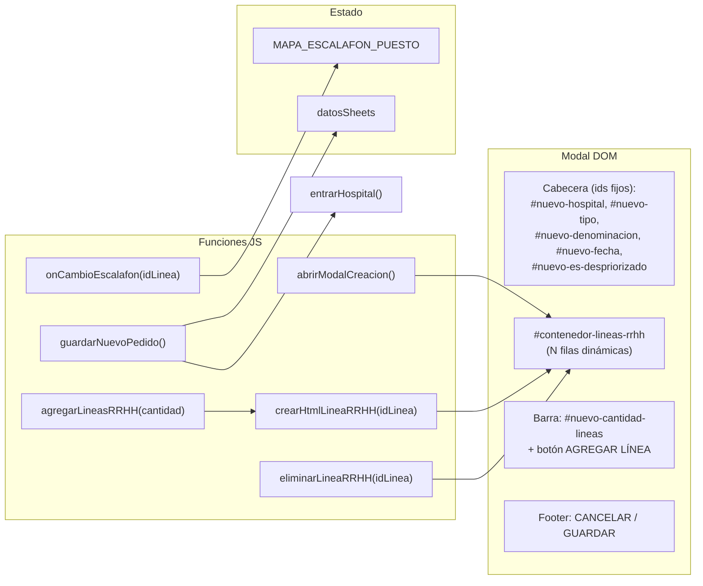

# Design Document

## Overview

Esta feature rediseña el modal "CREAR PEDIDO" (`#modal-creacion`) del archivo único `OBRAS v9.html` (JavaScript vanilla, sin frameworks ni dependencias). El rediseño transforma el modal actual (una sola línea de cargo en layout vertical, con `guardarNuevoPedido()` que solo muestra un `alert` placeholder) en un formulario con:

1. **Cabecera del pedido** vertical/apilada compartida (Hospital, Tipo de Pedido, Denominación, Fecha de Fin, checkbox Despriorizado).
2. **Detalle de RRHH** con líneas de cargo en layout **horizontal**, multi-línea, cada una independiente y eliminable (siempre queda ≥ 1).
3. Una regla de negocio nueva que restringe el campo **Puesto Nuevo** de cada línea a los puestos válidos del **escalafón** elegido en esa línea (mapa `MAPA_ESCALAFON_PUESTO`); si el escalafón no tiene puestos definidos o no existe en el mapa, Puesto pasa a **texto libre**.
4. `guardarNuevoPedido()` reescrita: valida obligatorios, arma el objeto `pedido` con todas sus líneas de `cargos`, lo agrega a `datosSheets` bajo el hospital elegido (persistencia **solo en memoria**), cierra el modal y refresca la vista.

El diseño reutiliza las clases, la paleta (`--azul-oscuro #153244`, `--celeste #8de2d6`, `--amarillo #ffcc00`) y la fuente Montserrat ya presentes, no altera la estructura de datos que consumen las funciones existentes (`entrarHospital`, chips de estado, búsqueda avanzada) y deja previsto un punto de integración con backend a futuro.

### Decisiones de diseño y su justificación

- **Líneas dinámicas por template + índice único (`idLinea`)**: cada línea de RRHH se genera con `crearHtmlLineaRRHH(idLinea)` y todos sus controles llevan sufijo `-${idLinea}` (p. ej. `#nuevo-escalafon-3`). Esto permite leer/escribir/eliminar una línea de forma aislada sin colisión de ids y sin depender del orden del DOM. Se elige un **contador monótono** (`contadorLineasRRHH`) en lugar de reindexar, para que eliminar una línea no invalide referencias de las restantes.
- **Reconstrucción del campo Puesto en el DOM (no ocultar/mostrar)**: al cambiar el escalafón, `onCambioEscalafon(idLinea)` **reemplaza** el nodo del campo Puesto (`<select>` filtrado ↔ `<input type="text">`). Es más simple y robusto que mantener dos controles ocultos sincronizados, y garantiza que solo exista un control Puesto por línea con id estable (`#nuevo-puesto-${idLinea}`).
- **Fallback seguro cuando el escalafón no está en el mapa**: los escalafones de `catalogos.escalafones` pueden diferir levemente de las claves de `MAPA_ESCALAFON_PUESTO`. La regla es: clave ausente o lista vacía ⇒ Puesto texto libre. Esto evita que un escalafón no mapeado deje al usuario sin poder cargar el puesto.
- **Fecha como string tal cual la ingresa el usuario**: se mantiene coherencia con los datos reales (`DD/MM/AA`, `DD/MM/AAAA`, `YYYY-MM-DD…` o solo año). No se normaliza ni valida formato, para no romper el consumo existente.
- **Persistencia en memoria + punto de integración**: `guardarNuevoPedido()` hace `push` a `datosSheets[hospital]`. Se aísla el envío futuro en una función stub `persistirPedidoBackend(hospital, pedido)` (no-op documentado) para tener un único lugar de integración.

## Architecture

El flujo completo del usuario dentro del modal rediseñado:

```mermaid
flowchart TD
    A["Click + CREAR PEDIDO<br/>abrirModalCreacion()"] --> B["Reset del modal:<br/>limpiar cabecera + dejar 1 línea RRHH limpia"]
    B --> C["Modal abierto"]

    C --> D{"Acción del usuario"}
    D -->|"Click AGREGAR LÍNEA (cantidad N)"| E["agregarLineasRRHH(N)<br/>appende N filas al<br/>#contenedor-lineas-rrhh"]
    E --> C
    D -->|"Click eliminar línea i"| F["eliminarLineaRRHH(i)"]
    F --> G{"¿Es la última línea?"}
    G -->|Sí| H["No eliminar<br/>(siempre queda ≥ 1)"] --> C
    G -->|No| I["Quitar fila del DOM"] --> C
    D -->|"Cambia Escalafón de línea i"| J["onCambioEscalafon(i)"]
    J --> K{"Escalafón en MAPA<br/>con puestos?"}
    K -->|Sí| L["Puesto = <select> filtrado<br/>a puestos válidos"] --> M["Resetear Puesto"] --> C
    K -->|No / vacío| N["Puesto = <input> texto libre"] --> M
    D -->|"Click CANCELAR / afuera"| Z["cerrarModalCreacion()"]

    D -->|"Click GUARDAR"| O["guardarNuevoPedido()"]
    O --> P["Validar obligatorios:<br/>Hospital, Tipo, Denominación,<br/>y por línea Escalafón + Puesto"]
    P --> Q{"¿Válido?"}
    Q -->|No| R["Avisar campos faltantes<br/>(alert) y cancelar guardado"] --> C
    Q -->|Sí| S["Armar objeto pedido<br/>+ cargos (todas las líneas)"]
    S --> T["datosSheets[hospital].push(pedido)<br/>(crear clave si no existe)"]
    T --> T2["persistirPedidoBackend()<br/>(stub - punto integración)"]
    T2 --> U["cerrarModalCreacion()"]
    U --> V["entrarHospital(hospital)<br/>refresca la vista"]
```



Componentes lógicos:



## Components and Interfaces

Todo el markup vive dentro de `#modal-creacion .cajon-pedido` en `OBRAS v9.html`. El markup estático actual del Detalle de RRHH (una sola línea con ids fijos `#nuevo-tipoq`, `#nuevo-escalafon`, `#nuevo-puesto`, `#nuevo-qplan`, `#nuevo-canal`, `#nuevo-qpedido`, `#nuevo-expediente`, `#nuevo-qaprobado`) se **reemplaza** por un contenedor dinámico. Los ids fijos de línea única dejan de existir; en su lugar cada campo lleva sufijo por línea.

### Estructura DOM nueva del modal

La cabecera se conserva casi igual (ids fijos). Cambia todo lo que hay dentro de `.seccion-cargos`:

```html
<div class="modal-overlay" id="modal-creacion" onclick="cerrarModalAfuera(event)">
  <div class="cajon-pedido cajon-creacion" style="opacity:1; transform:scale(1); animation:none; max-height:90vh; overflow-y:auto; padding:25px;">
    <h2 ...>NUEVO PEDIDO DE OBRA</h2>

    <!-- CABECERA (vertical, ids fijos - sin cambios de id) -->
    <div class="etiqueta">Hospital</div>
    <select class="input-creacion" id="nuevo-hospital" aria-label="Hospital del pedido"></select>
    <div class="etiqueta">Tipo de Pedido</div>
    <select class="input-creacion" id="nuevo-tipo" aria-label="Tipo de pedido"></select>
    <div class="etiqueta">Denominación / Detalle</div>
    <input type="text" class="input-creacion" id="nuevo-denominacion" placeholder="Ej: 5 NUEVAS CAMAS UTI" aria-label="Denominación o detalle">
    <div class="etiqueta">Fecha de Fin</div>
    <input type="text" class="input-creacion" id="nuevo-fecha" placeholder="Ej: 28/11/26" aria-label="Fecha de fin">
    <div style="margin:15px 0; display:flex; align-items:center; gap:8px;">
      <input type="checkbox" id="nuevo-es-despriorizado" ...>
      <label for="nuevo-es-despriorizado" ...>Despriorizado</label>
    </div>

    <!-- DETALLE DE RRHH (dinámico) -->
    <div class="seccion-cargos abierto" style="border-top:2px dashed var(--gris-bordes); margin-top:5px; padding-top:15px;">
      <div class="etiqueta" style="background-color:var(--amarillo); margin-top:0; margin-bottom:15px;">DETALLE DE RRHH (Cargos)</div>

      <!-- Contenedor donde se inyectan las filas dinámicas -->
      <div id="contenedor-lineas-rrhh"></div>

      <!-- Barra AGREGAR LÍNEA + selector cantidad -->
      <div class="barra-agregar-linea">
        <input type="number" id="nuevo-cantidad-lineas" class="input-num"
               min="1" max="10" value="1" step="1"
               onfocus="this.select()" aria-label="Cantidad de líneas a agregar (1 a 10)">
        <button type="button" class="btn-agregar-fila"
                onclick="agregarLineasRRHH(parseInt(document.getElementById('nuevo-cantidad-lineas').value, 10))"
                aria-label="Agregar línea de pedido">+ AGREGAR LÍNEA DE PEDIDO</button>
      </div>
    </div>

    <!-- FOOTER -->
    <div class="contenedor-botones-copiar" style="margin-top:20px;">
      <button class="btn-copiar" style="border-color:#ccc; color:#555;" onclick="cerrarModalCreacion()">CANCELAR</button>
      <button class="btn-copiar" style="background-color:var(--azul-oscuro); color:var(--blanco); border-color:var(--azul-oscuro);" onclick="guardarNuevoPedido()">GUARDAR</button>
    </div>
  </div>
</div>
```

Notas:
- Se agrega la clase `cajon-creacion` al `.cajon-pedido` del modal para poder ampliar su ancho (ver Estrategia responsive) sin afectar los `.cajon-pedido` de la grilla.
- `#nuevo-cantidad-lineas` usa `type="number"` con `min="1" max="10"`. La lógica igualmente **clampa** el valor en JS (defensa ante entradas fuera de rango).

### Template de una línea de RRHH (layout horizontal)

Cada línea es un `.linea-rrhh` con `data-id-linea="${idLinea}"`, una fila principal horizontal (6 campos) y un renglón secundario (Canal + Expediente + botón eliminar). Todos los ids llevan sufijo `-${idLinea}`:

```html
<div class="linea-rrhh" data-id-linea="7">
  <!-- Fila principal horizontal -->
  <div class="linea-rrhh-fila">
    <div class="campo-rrhh campo-tipoq">
      <label for="nuevo-tipoq-7">Tipo de Q</label>
      <select class="input-creacion" id="nuevo-tipoq-7" aria-label="Tipo de Q línea 7"><!-- opciones catalogos.tiposQ --></select>
    </div>
    <div class="campo-rrhh campo-escalafon">
      <label for="nuevo-escalafon-7">Escalafón</label>
      <select class="input-creacion" id="nuevo-escalafon-7" onchange="onCambioEscalafon(7)" aria-label="Escalafón línea 7"><!-- opciones catalogos.escalafones --></select>
    </div>
    <div class="campo-rrhh campo-puesto" id="contenedor-puesto-7">
      <label for="nuevo-puesto-7">Puesto Nuevo</label>
      <!-- Reconstruido por onCambioEscalafon: <select> filtrado O <input type=text> -->
      <input type="text" class="input-creacion" id="nuevo-puesto-7" placeholder="Puesto..." aria-label="Puesto nuevo línea 7">
    </div>
    <div class="campo-rrhh campo-num">
      <label for="nuevo-qplan-7">Q Plan</label>
      <input type="number" id="nuevo-qplan-7" class="input-num" value="0" onfocus="this.select()" aria-label="Q planificado línea 7">
    </div>
    <div class="campo-rrhh campo-num">
      <label for="nuevo-qpedido-7">Q Pedido</label>
      <input type="number" id="nuevo-qpedido-7" class="input-num" value="0" onfocus="this.select()" aria-label="Q pedido línea 7">
    </div>
    <div class="campo-rrhh campo-num">
      <label for="nuevo-qaprobado-7">Q Aprob.</label>
      <input type="number" id="nuevo-qaprobado-7" class="input-num" value="0" onfocus="this.select()" aria-label="Q aprobado línea 7">
    </div>
  </div>

  <!-- Renglón secundario -->
  <div class="linea-rrhh-secundaria">
    <div class="campo-rrhh campo-canal">
      <label for="nuevo-canal-7">Canal de Solicitud</label>
      <input type="text" id="nuevo-canal-7" class="input-creacion" placeholder="Ej: Mail, Nota..." aria-label="Canal de solicitud línea 7">
    </div>
    <div class="campo-rrhh campo-expediente">
      <label for="nuevo-expediente-7">Expediente</label>
      <input type="text" id="nuevo-expediente-7" class="input-creacion" placeholder="Ej: EX-2026-..." aria-label="Expediente línea 7">
    </div>
    <button type="button" class="btn-eliminar-linea" onclick="eliminarLineaRRHH(7)" aria-label="Eliminar línea 7">✕</button>
  </div>
</div>
```

### Interfaz de funciones (contrato)

| Función | Firma | Responsabilidad |
|---|---|---|
| `abrirModalCreacion()` | `() => void` | (modificada) Abre el overlay y **resetea** el modal a estado limpio con exactamente 1 línea de RRHH. |
| `resetearModalCreacion()` | `() => void` | (nueva, auxiliar) Limpia cabecera, vacía `#contenedor-lineas-rrhh`, resetea contador y crea 1 línea. |
| `agregarLineasRRHH(cantidad)` | `(cantidad: number) => void` | Clampa cantidad a `[1,10]` y appende esa cantidad de filas nuevas. |
| `crearHtmlLineaRRHH(idLinea)` | `(idLinea: number) => string` | Devuelve el HTML de una fila con todos los ids sufijados. |
| `poblarSelectsLineaRRHH(idLinea)` | `(idLinea: number) => void` | (nueva, auxiliar) Puebla `#nuevo-tipoq-{id}` y `#nuevo-escalafon-{id}` con los catálogos. |
| `eliminarLineaRRHH(idLinea)` | `(idLinea: number) => void` | Elimina la fila salvo que sea la única (≥ 1 garantizado). |
| `onCambioEscalafon(idLinea)` | `(idLinea: number) => void` | Reconstruye el campo Puesto de esa línea (select filtrado o input libre) y resetea su valor. |
| `guardarNuevoPedido()` | `() => void` | (reescrita) Valida, arma el pedido, hace push a `datosSheets`, cierra y refresca. |
| `leerLineaRRHH(idLinea)` | `(idLinea: number) => Cargo` | (nueva, auxiliar) Lee los inputs de una línea y devuelve el objeto `cargo`. |
| `persistirPedidoBackend(hospital, pedido)` | `(hospital: string, pedido: Pedido) => void` | (nueva, stub) Punto de integración backend futuro. No-op documentado. |

Estado de módulo nuevo:
- `let contadorLineasRRHH = 0;` — contador monótono para generar `idLinea` únicos.

Interacción con lo existente:
- `poblarSelect(id, opciones)` se reutiliza para poblar los selects por línea.
- `catalogos.tiposQ` y `catalogos.escalafones` alimentan los selects.
- `entrarHospital(hospitalActual)` se llama al final del guardado para refrescar la vista.
- Se **elimina** de `iniciarApp()` el poblado de los selects de línea única obsoletos (`poblarSelect('nuevo-tipoq', …)`, `poblarSelect('nuevo-escalafon', …)`, `poblarSelect('nuevo-puesto', …)`), ya que ahora se pueblan por línea. Se conservan `poblarSelect('nuevo-tipo', catalogos.tiposPedido)` (cabecera) e `inicializarHospitales()`.

## Data Models

### Constante global `MAPA_ESCALAFON_PUESTO`

Se inyecta en `OBRAS v9.html` como constante global JS (contenido tomado de `esc_puesto.json`). Formato `{ [escalafon: string]: string[] }`. Escalafones con puestos: ENFERMERIA(2), CETPS(28), CPH MEDICO GUARDIA(85), CPH NO MEDICO GUARDIA(48), CPH MEDICO PLANTA(85), CPH NO MEDICO PLANTA(48), ESCALAFON GRAL.(95), SERVICIOS GRALES. ANEXO II(7). Escalafones con lista vacía (⇒ Puesto texto libre): LOYS, PLANTA DE GABINETE, GERENTE OPERATIVO, SUBGERENTE OPERATIVO, JEFE DE DEPARTAMENTO, JEFE DE DIVISION, JEFE DE SECCION, JEFE DE UNIDAD.

```js
const MAPA_ESCALAFON_PUESTO = {
  "ENFERMERIA": ["ENFERMERIA", "ENFERMERIA ATP"],
  "CETPS": ["BIOTERIO", "LIC. EN BIOTECONOLOGIA", /* ...28 en total... */],
  "CPH MEDICO GUARDIA": [ /* ...85... */ ],
  "CPH NO MEDICO GUARDIA": [ /* ...48... */ ],
  "CPH MEDICO PLANTA": [ /* ...85... */ ],
  "CPH NO MEDICO PLANTA": [ /* ...48... */ ],
  "ESCALAFON GRAL.": [ /* ...95... */ ],
  "SERVICIOS GRALES. ANEXO II": [ /* ...7... */ ],
  "LOYS": [], "PLANTA DE GABINETE": [], "GERENTE OPERATIVO": [],
  "SUBGERENTE OPERATIVO": [], "JEFE DE DEPARTAMENTO": [], "JEFE DE DIVISION": [],
  "JEFE DE SECCION": [], "JEFE DE UNIDAD": []
};
```

Función de consulta con fallback seguro:

```
FUNCION puestosDeEscalafon(escalafon) -> string[]
  SI escalafon NO es clave de MAPA_ESCALAFON_PUESTO -> devolver []   // fallback: texto libre
  DEVOLVER MAPA_ESCALAFON_PUESTO[escalafon]
```

Regla derivada: `esPuestoTextoLibre(escalafon) = (puestosDeEscalafon(escalafon).length === 0)`.

### Objeto `pedido` (compatible con `datosSheets`)

`datosSheets = { "NombreEfector": [ pedido, ... ] }`. El pedido armado por `guardarNuevoPedido()`:

```js
pedido = {
  tipo:      valorDe('#nuevo-tipo'),            // string
  detalle:   valorDe('#nuevo-denominacion'),    // string
  fecha:     valorDe('#nuevo-fecha'),           // string, tal cual lo ingresa el usuario
  prioridad: checkbox('#nuevo-es-despriorizado') ? "DESPRIORIZADO" : "-",
  cargos:    [ cargo, ... ]                      // una entrada por cada línea de RRHH
}
```

### Objeto `cargo` (una por línea de RRHH)

Armado por `leerLineaRRHH(idLinea)`:

```js
cargo = {
  tipoQ:      valorDe(`#nuevo-tipoq-${id}`),                 // string
  escalafon:  valorDe(`#nuevo-escalafon-${id}`),             // string
  puesto:     valorDe(`#nuevo-puesto-${id}`),                // string (select filtrado o texto libre)
  qPlan:      numeroDe(`#nuevo-qplan-${id}`),                // Number (0 por defecto)
  canal:      valorDe(`#nuevo-canal-${id}`),                 // string
  qPedido:    numeroDe(`#nuevo-qpedido-${id}`),              // Number (0 por defecto)
  expediente: valorDe(`#nuevo-expediente-${id}`),            // string
  qAprobado:  numeroDe(`#nuevo-qaprobado-${id}`),            // Number (0 por defecto)
  validado:   false,                                         // default
  resuelto:   false                                          // default
}
```

`numeroDe(sel)`: `parseInt(value, 10)`; si es `NaN` ⇒ `0`. Los defaults `validado:false` y `resuelto:false` mantienen compatibilidad con las funciones existentes que consumen `datosSheets`.

## Diseño de funciones (pseudocódigo formal)

### `abrirModalCreacion()` (modificada)

```
PROCEDIMIENTO abrirModalCreacion()
  PRE:  el DOM del modal existe
  POST: overlay con clase 'abierto'; modal reseteado con exactamente 1 línea RRHH limpia
  ---
  resetearModalCreacion()
  document.getElementById('modal-creacion').classList.add('abierto')
```

### `resetearModalCreacion()` (nueva, auxiliar)

```
PROCEDIMIENTO resetearModalCreacion()
  POST: cabecera limpia; #contenedor-lineas-rrhh contiene exactamente 1 línea; contadorLineasRRHH consistente
  ---
  // Cabecera
  #nuevo-hospital.selectedIndex = 0
  #nuevo-tipo.selectedIndex = 0
  #nuevo-denominacion.value = ""
  #nuevo-fecha.value = ""
  #nuevo-es-despriorizado.checked = false
  #nuevo-cantidad-lineas.value = 1
  // Líneas
  #contenedor-lineas-rrhh.innerHTML = ""
  contadorLineasRRHH = 0
  agregarLineasRRHH(1)
```

### `agregarLineasRRHH(cantidad)`

```
PROCEDIMIENTO agregarLineasRRHH(cantidad)
  PRE:  cantidad es número (posible fuera de rango o NaN)
  POST: se appendaron clamp(cantidad,1,10) filas nuevas; cada una con idLinea único; selects poblados
  ---
  n = cantidad
  SI n NO es entero válido -> n = 1
  n = max(1, min(10, n))                 // clamp defensivo (Req 4.3)
  cont = document.getElementById('contenedor-lineas-rrhh')
  REPETIR n veces:
     contadorLineasRRHH = contadorLineasRRHH + 1
     id = contadorLineasRRHH
     cont.insertAdjacentHTML('beforeend', crearHtmlLineaRRHH(id))
     poblarSelectsLineaRRHH(id)          // tipoQ y escalafón
     // Puesto arranca como <input> texto libre (escalafón sin seleccionar -> fallback [])
```

Invariante: cada llamada agrega exactamente `clamp(cantidad,1,10)` líneas y el número total nunca disminuye por esta operación.

### `crearHtmlLineaRRHH(idLinea)`

```
FUNCION crearHtmlLineaRRHH(idLinea) -> string
  PRE:  idLinea es entero único no usado en el DOM actual
  POST: devuelve HTML de una .linea-rrhh con data-id-linea=idLinea y todos los controles
        sufijados '-idLinea'; el campo Puesto se inicializa como <input type=text> (texto libre)
  ---
  DEVOLVER plantilla_string( idLinea )   // ver "Template de una línea de RRHH"
  // Los selects tipoQ/escalafon se dejan vacíos aquí y se pueblan en poblarSelectsLineaRRHH.
  // El <select> de escalafón incluye onchange="onCambioEscalafon(idLinea)".
```

### `poblarSelectsLineaRRHH(idLinea)` (nueva, auxiliar)

```
PROCEDIMIENTO poblarSelectsLineaRRHH(idLinea)
  POST: #nuevo-tipoq-{id} poblado con catalogos.tiposQ; #nuevo-escalafon-{id} con catalogos.escalafones
  ---
  poblarSelect(`nuevo-tipoq-${idLinea}`, catalogos.tiposQ)
  poblarSelect(`nuevo-escalafon-${idLinea}`, catalogos.escalafones)
```

### `eliminarLineaRRHH(idLinea)`

```
PROCEDIMIENTO eliminarLineaRRHH(idLinea)
  PRE:  existe una .linea-rrhh con data-id-linea=idLinea
  POST: si había > 1 línea, se elimina la fila indicada; si era la única, no se elimina nada
  INVARIANTE: al terminar, el número de líneas es >= 1  (Req 5.3, 5.4)
  ---
  cont = document.getElementById('contenedor-lineas-rrhh')
  lineas = cont.querySelectorAll('.linea-rrhh')
  SI lineas.length <= 1 -> RETORNAR          // conservar al menos una
  fila = cont.querySelector(`.linea-rrhh[data-id-linea="${idLinea}"]`)
  SI fila existe -> fila.remove()
```

### `onCambioEscalafon(idLinea)`

```
PROCEDIMIENTO onCambioEscalafon(idLinea)
  PRE:  existe #nuevo-escalafon-{id} y su contenedor #contenedor-puesto-{id}
  POST: el campo Puesto de esa línea se reconstruye según el escalafón:
        - con puestos definidos -> <select> limitado a esos puestos
        - sin puestos / no mapeado -> <input type=text> texto libre
        y el valor del Puesto queda reseteado (Req 6.2, 6.3, 6.4, 6.5)
  ---
  esc = document.getElementById(`nuevo-escalafon-${idLinea}`).value
  puestos = puestosDeEscalafon(esc)          // [] si no está en el mapa (fallback)
  cont = document.getElementById(`contenedor-puesto-${idLinea}`)
  label = `<label for="nuevo-puesto-${idLinea}">Puesto Nuevo</label>`
  SI puestos.length > 0:
     opciones = '<option value="" disabled selected>Seleccioná...</option>'
     PARA cada p EN puestos: opciones += `<option value="${p}">${p}</option>`
     cont.innerHTML = label +
        `<select class="input-creacion" id="nuevo-puesto-${idLinea}" aria-label="Puesto nuevo línea ${idLinea}">${opciones}</select>`
  SINO:
     cont.innerHTML = label +
        `<input type="text" class="input-creacion" id="nuevo-puesto-${idLinea}" placeholder="Puesto..." aria-label="Puesto nuevo línea ${idLinea}">`
  // Al reconstruir el nodo, el valor previo del Puesto se pierde -> reset garantizado.
```

Nota de robustez: al usar los valores en atributos, escapar comillas si algún puesto las contiene (los puestos del mapa no las contienen, pero se documenta como precaución si el catálogo crece).

### `guardarNuevoPedido()` (reescrita)

```
PROCEDIMIENTO guardarNuevoPedido()
  PRE:  modal abierto con cabecera y >= 1 línea RRHH
  POST: si hay campos obligatorios faltantes -> avisa y NO persiste (Req 7.3)
        si todo válido -> agrega pedido a datosSheets[hospital], cierra modal, refresca vista (Req 8)
  ---
  hospital    = #nuevo-hospital.value
  tipo        = #nuevo-tipo.value
  denominacion= trim(#nuevo-denominacion.value)
  fecha       = #nuevo-fecha.value                 // string tal cual
  despri      = #nuevo-es-despriorizado.checked

  faltantes = []
  SI vacio(hospital)     -> faltantes.push("Hospital")
  SI vacio(tipo)         -> faltantes.push("Tipo de Pedido")
  SI vacio(denominacion) -> faltantes.push("Denominación / Detalle")

  cargos = []
  lineas = querySelectorAll('.linea-rrhh')
  PARA cada linea (i base 1 visual) con id = data-id-linea:
     c = leerLineaRRHH(id)
     SI vacio(c.escalafon) -> faltantes.push(`Escalafón (línea ${i})`)
     SI vacio(c.puesto)    -> faltantes.push(`Puesto Nuevo (línea ${i})`)
     cargos.push(c)

  SI faltantes NO vacío:
     alert("Faltan completar los siguientes campos:\n- " + faltantes.join("\n- "))
     RETORNAR                                       // cancela guardado

  pedido = { tipo, detalle: denominacion, fecha,
             prioridad: despri ? "DESPRIORIZADO" : "-",
             cargos }

  SI datosSheets[hospital] NO existe -> datosSheets[hospital] = []
  datosSheets[hospital].push(pedido)
  persistirPedidoBackend(hospital, pedido)          // stub: punto integración futuro

  cerrarModalCreacion()
  entrarHospital(hospital)                           // muestra el pedido recién creado
```

### `leerLineaRRHH(idLinea)` (nueva, auxiliar)

```
FUNCION leerLineaRRHH(idLinea) -> Cargo
  POST: devuelve el objeto cargo leído de los inputs de esa línea, con numéricos parseados
        y validado/resuelto en false
  ---
  DEVOLVER {
    tipoQ:      val(`nuevo-tipoq-${id}`),
    escalafon:  val(`nuevo-escalafon-${id}`),
    puesto:     val(`nuevo-puesto-${id}`),          // el nodo puede ser select o input
    qPlan:      num(`nuevo-qplan-${id}`),
    canal:      val(`nuevo-canal-${id}`),
    qPedido:    num(`nuevo-qpedido-${id}`),
    expediente: val(`nuevo-expediente-${id}`),
    qAprobado:  num(`nuevo-qaprobado-${id}`),
    validado:   false,
    resuelto:   false
  }
  // num(id): n = parseInt(value,10); DEVOLVER isNaN(n) ? 0 : n
```

### `persistirPedidoBackend(hospital, pedido)` (nueva, stub)

```
PROCEDIMIENTO persistirPedidoBackend(hospital, pedido)
  // Punto de integración con backend a futuro (Req 9.2).
  // Actualmente NO hace nada: la persistencia es solo en memoria (Req 8.7, 9.1).
  // A futuro: POST a la API correspondiente con { hospital, pedido }.
  RETORNAR
```

## Estrategia responsive

La fila principal de RRHH usa CSS Grid para el layout horizontal (>768px) y se apila en Vista_Compacta (≤768px). Se agrega al `<style>` de `OBRAS v9.html`:

```css
/* Ancho ampliado del modal de creación para layout horizontal */
.cajon-creacion { width: 720px; max-width: 95vw; }

/* Barra AGREGAR LÍNEA */
.barra-agregar-linea { display: flex; align-items: center; gap: 8px; margin-top: 10px; }
.barra-agregar-linea #nuevo-cantidad-lineas { flex: 0 0 60px; margin: 0; }
.barra-agregar-linea .btn-agregar-fila { flex: 1; }

/* Línea de RRHH */
.linea-rrhh { border: 1px solid var(--gris-bordes); border-radius: 8px; padding: 10px; margin-bottom: 12px; background: var(--gris-claro); }
.linea-rrhh-fila {
  display: grid;
  grid-template-columns: 1fr 1.3fr 1.5fr 0.7fr 0.7fr 0.7fr; /* tipoQ, escalafón, puesto, qPlan, qPedido, qAprob */
  gap: 8px; align-items: end;
}
.linea-rrhh-secundaria { display: flex; gap: 8px; align-items: end; margin-top: 8px; }
.campo-rrhh { display: flex; flex-direction: column; }
.campo-rrhh label { font-size: 10px; font-weight: 700; color: #555; margin-bottom: 3px; }
.campo-rrhh.campo-canal { flex: 2; }
.campo-rrhh.campo-expediente { flex: 2; }
.campo-rrhh .input-creacion { margin: 0; }
.btn-eliminar-linea {
  flex: 0 0 auto; align-self: center; background: var(--blanco);
  border: 1px solid var(--naranja-fuerte); color: var(--naranja-fuerte);
  border-radius: 6px; padding: 6px 10px; font-weight: 800; cursor: pointer;
  font-family: 'Montserrat', sans-serif;
}
.btn-eliminar-linea:hover { background: var(--naranja-fuerte); color: var(--blanco); }

/* Vista compacta: apilar la fila horizontal (Req 3.1) */
@media (max-width: 768px) {
  .cajon-creacion { width: 100%; max-width: 100%; padding: 15px; }
  .linea-rrhh-fila { grid-template-columns: 1fr 1fr; }      /* 2 columnas */
  .linea-rrhh-secundaria { flex-wrap: wrap; }
}
```

Justificación: Grid con `grid-template-columns` fijas por rol da la disposición horizontal en una fila (Req 2.2, 3.2) y colapsa a 2 columnas en móvil evitando desborde/scroll horizontal (Req 3.1). El `max-width: 95vw` evita que el modal ampliado (720px) desborde en pantallas intermedias.

## Correctness Properties

*Una propiedad es una característica o comportamiento que debe cumplirse en todas las ejecuciones válidas de un sistema: es una afirmación formal de lo que el sistema debe hacer. Las propiedades son el puente entre las especificaciones legibles por humanos y las garantías de correctitud verificables por máquina.*

Las siguientes propiedades cubren la **lógica pura** de la feature (regla escalafón→puesto, clamp de cantidad, invariante de líneas, armado del pedido/cargo, validación y persistencia). Los criterios de layout, responsive, estilo y accesibilidad se cubren con ejemplos y verificación manual (ver Testing Strategy).

### Property 1: Puesto según escalafón

*Para todo* escalafón `esc`, si `MAPA_ESCALAFON_PUESTO[esc]` existe y tiene lista no vacía, el campo Puesto de esa línea se presenta como selector cuyas opciones son exactamente esa lista de puestos válidos; y si `esc` no es clave del mapa o su lista es vacía, el campo Puesto se presenta como entrada de texto libre.

**Validates: Requirements 6.2, 6.3**

### Property 2: Cambiar escalafón resetea el puesto

*Para toda* línea de RRHH con un puesto ya seleccionado, al cambiar su escalafón (`onCambioEscalafon`) el valor del campo Puesto queda reseteado (vacío), independientemente del valor previo.

**Validates: Requirements 6.4**

### Property 3: Integridad del mapa escalafón→puesto

*Para todo* escalafón del conjunto definido, la cantidad de puestos válidos en `MAPA_ESCALAFON_PUESTO` es exactamente: ENFERMERIA=2, CETPS=28, CPH MEDICO GUARDIA=85, CPH NO MEDICO GUARDIA=48, CPH MEDICO PLANTA=85, CPH NO MEDICO PLANTA=48, ESCALAFON GRAL.=95, SERVICIOS GRALES. ANEXO II=7; y para LOYS, PLANTA DE GABINETE, GERENTE OPERATIVO, SUBGERENTE OPERATIVO, JEFE DE DEPARTAMENTO, JEFE DE DIVISION, JEFE DE SECCION y JEFE DE UNIDAD la lista es de longitud 0.

**Validates: Requirements 6.6, 6.7**

### Property 4: Agregado clampado de líneas

*Para todo* entero `n` (incluyendo valores fuera de rango o no válidos), invocar `agregarLineasRRHH(n)` agrega exactamente `clamp(n, 1, 10)` líneas nuevas al Detalle_RRHH; nunca menos de 1 ni más de 10.

**Validates: Requirements 4.3, 4.4**

### Property 5: Invariante de al menos una línea

*Para toda* secuencia de operaciones de agregar y eliminar líneas, el número de líneas del Detalle_RRHH es siempre mayor o igual a 1; y `eliminarLineaRRHH(id)` elimina la línea indicada salvo cuando es la única existente, en cuyo caso el estado no cambia.

**Validates: Requirements 5.2, 5.3, 5.4**

### Property 6: Independencia de valores entre líneas

*Para todo* conjunto de líneas de RRHH con valores asignados de forma independiente, leer cada línea (`leerLineaRRHH`) devuelve exactamente los valores propios de esa línea, sin interferencia de las demás.

**Validates: Requirements 4.7, 6.5**

### Property 7: Armado y forma del pedido y del cargo

*Para todo* conjunto válido de valores de cabecera y líneas, el pedido armado contiene los campos `tipo`, `detalle`, `fecha`, `prioridad` y `cargos`; `prioridad` es `"DESPRIORIZADO"` si y solo si el checkbox Despriorizado está marcado, y `"-"` en caso contrario; y cada `cargo` contiene los campos `tipoQ`, `escalafon`, `puesto`, `qPlan`, `canal`, `qPedido`, `expediente`, `qAprobado`, con `validado === false` y `resuelto === false`, y con los campos numéricos parseados a número (0 cuando el input es vacío o no numérico).

**Validates: Requirements 4.5, 8.2, 8.3, 8.4, 10.3**

### Property 8: Guardado condicionado a campos obligatorios

*Para todo* estado del formulario, `guardarNuevoPedido()` agrega el pedido a `datosSheets` si y solo si están completos todos los campos obligatorios (Hospital, Tipo de Pedido y Denominación en la cabecera, y Escalafón y Puesto en cada línea); si falta al menos uno, no se agrega ningún pedido y se reportan los campos faltantes.

**Validates: Requirements 7.1, 7.2, 7.3**

### Property 9: Persistencia del pedido bajo el hospital

*Para todo* pedido válido guardado, tras `guardarNuevoPedido()` el arreglo `datosSheets[hospital]` correspondiente al Hospital seleccionado contiene ese pedido, creándose la clave del hospital si no existía previamente.

**Validates: Requirements 8.1**

## Error Handling

- **Campos obligatorios faltantes**: `guardarNuevoPedido()` acumula todos los faltantes (cabecera y por línea) y los muestra en un único `alert` legible, cancelando el guardado sin modificar `datosSheets`. No se persiste nada parcial.
- **Cantidad de líneas inválida o fuera de rango**: `agregarLineasRRHH` clampa a `[1,10]` y trata `NaN`/no entero como 1, evitando estados inconsistentes.
- **Campos numéricos vacíos o no numéricos**: `num()` devuelve `0` ante `NaN`, garantizando que `qPlan`/`qPedido`/`qAprobado` siempre sean números.
- **Escalafón no presente en el mapa**: `puestosDeEscalafon` devuelve `[]` (fallback), de modo que Puesto pasa a texto libre en lugar de dejar el control roto o vacío.
- **Intento de eliminar la última línea**: `eliminarLineaRRHH` no hace nada, preservando el invariante ≥ 1.
- **Hospital sin pedidos previos**: al guardar se crea `datosSheets[hospital] = []` antes del `push`.
- **Error de carga de catálogos**: el flujo existente de `iniciarApp()` ya maneja el fallback a datos locales; los selects por línea se pueblan con `catalogos` ya resuelto, por lo que no se introduce manejo nuevo.

## Testing Strategy

La feature es mayormente **manipulación de DOM y estado en memoria**, con dos núcleos de **lógica pura** claramente testeables como propiedades: (a) la regla escalafón→puesto y (b) el armado del objeto `cargo`/`pedido`. Se adopta un enfoque dual: property-based tests para la lógica pura y ejemplos/edge cases para el resto.

Para poder testear en vanilla JS sin dependencias de runtime en producción, la lógica pura (`puestosDeEscalafon`, `esPuestoTextoLibre`, el armado de `pedido`/`cargo` a partir de un objeto plano de valores, y el clamp de cantidad) debe ser **extraíble a funciones puras** que no lean del DOM directamente (el lector del DOM las invoca). Los tests se ejecutan con una librería de PBT del ecosistema JS (**fast-check** sobre un runner tipo Jest/Vitest), en un entorno de test separado; **no se agrega ninguna dependencia a `OBRAS v9.html`**.

**Property tests** (mínimo 100 iteraciones por propiedad; una única prueba property-based por propiedad; cada test etiquetado con comentario `// Feature: crear-pedido-rediseno, Property N: <texto de la propiedad>`):

- Property 1 → generar escalafones (del subconjunto con puestos y de escalafones ausentes/vacíos) y verificar select filtrado vs. texto libre y que las opciones == `MAPA_ESCALAFON_PUESTO[esc]`.
- Property 2 → tras `onCambioEscalafon`, el valor de Puesto es `""` para cualquier valor previo.
- Property 3 → asserts de longitud exacta por escalafón (cantidades y listas vacías).
- Property 4 → para cualquier entero `n`, el conteo crece en `clamp(n,1,10)`.
- Property 5 → modelo abstracto con secuencia aleatoria de add/remove; invariante conteo ≥ 1 y remove correcto.
- Property 6 → N líneas con valores random distintos; leer cada una devuelve sus propios valores.
- Property 7 → round-trip valores → objeto `pedido`/`cargo` (campos, defaults `validado`/`resuelto`, prioridad, parseo numérico).
- Property 8 → estados random; persiste sii todos los obligatorios completos, si no reporta faltantes y no persiste.
- Property 9 → tras guardar un pedido válido, aparece en `datosSheets[hospital]` (crea la clave si falta).

**Unit tests (ejemplos/edge cases)**: presencia de ids de cabecera y controles tras reset del modal (Req 1.x, 2.x), checkbox despriorizado inicial no marcado (Req 1.6), textos vacíos en línea nueva (Req 4.6), presencia de aria-labels (Req 12.1–12.4), stub `persistirPedidoBackend` no-op (Req 8.7, 9.2), fecha guardada tal cual se ingresa.

**Verificación manual en navegador** (no automatizable acá): layout horizontal >768px y apilado ≤768px (Req 3.1, 3.2), estilo/paleta/Montserrat (Req 11.x), cierre al clic afuera (Req 10.1), refresco de la vista con `entrarHospital` (Req 8.5), cierre del modal al guardar (Req 8.6), no regresión de chips/búsqueda/navegación (Req 10.2).

**Extracción para testabilidad**: la lógica pura (`puestosDeEscalafon`, `esPuestoTextoLibre`, `clamp`, armado de `cargo`/`pedido` a partir de un objeto plano de valores, y el modelo abstracto de líneas) debe implementarse como funciones puras que no lean el DOM directamente; los lectores del DOM las invocan. Esto permite testearlas con **fast-check** sobre un runner (Jest/Vitest) en un entorno de test separado.

## Dependencies

**Ninguna dependencia nueva en producción.** `OBRAS v9.html` permanece 100% vanilla JavaScript, sin frameworks ni librerías externas (Req 11.1). La única adición al archivo es la constante global `MAPA_ESCALAFON_PUESTO` (datos, no código de terceros) y las funciones descritas.

Las herramientas de testing (runner tipo Jest/Vitest + `fast-check` para PBT) viven exclusivamente en el entorno de desarrollo/CI y **no se incluyen ni referencian** en el archivo entregable.
