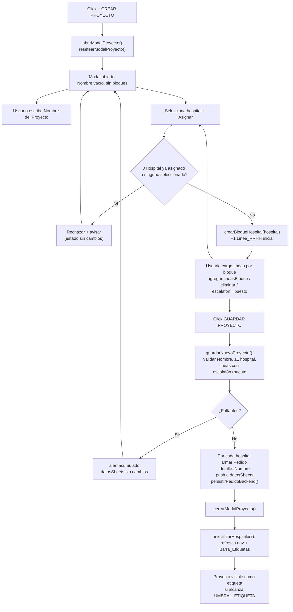
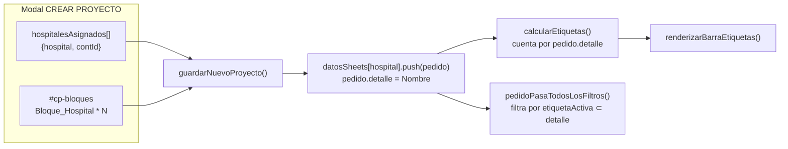

# Design Document — Módulo CREAR PROYECTO

## Overview

Este documento describe el diseño técnico del módulo **CREAR PROYECTO** dentro de la SPA `OBRAS v9.html`. El módulo agrega un flujo análogo a CREAR PEDIDO, pero orientado a crear una **vista global / etiqueta** (un *Proyecto*) que agrupa pedidos de obra de uno o más hospitales.

Un *Proyecto* no es una entidad de primera clase en el modelo de datos actual: se materializa como uno o varios `Pedido` cuya denominación (`detalle`) coincide con el nombre del Proyecto. La detección de etiquetas existente (`calcularEtiquetas`) cuenta los pedidos por `detalle`; por lo tanto, al crear un pedido por cada hospital asignado con `detalle = nombreProyecto`, el Proyecto aparece automáticamente en la `Barra_Etiquetas` cuando alcanza el umbral, y su filtrado (`etiquetaActiva` + `pedidoPasaTodosLosFiltros`) muestra los pedidos de todos los hospitales cuya denominación contiene el nombre. Este enfoque reutiliza la maquinaria de etiquetas sin tocarla (Req 8).

Restricciones de implementación (heredadas de `contrato.md` y del stack):
- Todo el código vive dentro de `OBRAS v9.html`: HTML, CSS `<style>` y JavaScript vanilla inline. Sin librerías, sin build, sin archivos nuevos (Req 11.4).
- Paleta fija: principal `#153244` (`--azul-oscuro`), secundario `#8de2d6` (`--celeste`), terciario `#ffcc00` (`--amarillo`); tipografía Montserrat (Req 1.4, 10.3).
- Contenedores adaptables al contenido. CREAR PROYECTO **no** es la excepción de tamaño fijo (esa excepción es exclusiva de `#modal-busqueda`) (Req 10.1, 10.2).
- Persistencia solo en memoria sobre `datosSheets`; el backend es el stub `persistirPedidoBackend(hospital, pedido)` (Req 7.8).

Decisión estructural central: **reutilizar** las funciones de línea de RRHH de CREAR PEDIDO generalizándolas para operar sobre un contenedor objetivo arbitrario, manteniendo `contadorLineasRRHH` como **fuente única y monótona** de ids `nuevo-*-{idLinea}`. Así, las líneas de cualquier bloque de cualquier hospital y las del modal CREAR PEDIDO nunca comparten identificadores (Req 4.10, Req 11.2), con **cero regresión** en CREAR PEDIDO.

## Architecture

El módulo se compone de tres capas dentro del mismo archivo:

1. **Presentación (HTML + CSS):** botón flotante, overlay `#modal-proyecto`, cajón adaptable, campo Nombre, selector de hospital con botón "Asignar", y el contenedor de bloques `#cp-bloques`. Cada `Bloque_Hospital` reutiliza la estética de `.cajon-creacion` / `.linea-rrhh`.
2. **Estado en memoria del modal:** una lista `hospitalesAsignados` (nombres + referencia a su contenedor de líneas) que refleja el DOM. Es el estado de sesión del modal; se resetea al abrir.
3. **Lógica compartida y persistencia:** funciones de línea de RRHH generalizadas (compartidas con CREAR PEDIDO) + `guardarNuevoProyecto`, que escribe en `datosSheets` y refresca la UI vía `inicializarHospitales`.

### Flujo del modal



### Relación con datos y etiquetas



## Components and Interfaces

### HTML nuevo (dentro de `<body>`)

- **Botón flotante** (mismo patrón que `+ CREAR PEDIDO`):
  ```html
  <button class="btn-crear-flotante btn-crear-proyecto"
          onclick="abrirModalProyecto()"
          aria-label="Abrir el formulario para crear un nuevo proyecto agrupador">
    <span style="font-size:18px;">+</span> CREAR PROYECTO
  </button>
  ```
  Se ubica junto al botón CREAR PEDIDO (offset lateral vía `.btn-crear-proyecto`) para no solaparse (Req 1.1, 1.4, 1.5).

- **Overlay + cajón adaptable:**
  ```html
  <div class="modal-overlay" id="modal-proyecto" onclick="cerrarModalProyectoAfuera(event)">
    <div class="cajon-pedido cajon-creacion cajon-proyecto"
         style="max-height:95vh; overflow-y:auto; padding:25px;">
      <h2>NUEVO PROYECTO</h2>
      <!-- Nombre -->
      <div class="etiqueta">Nombre del Proyecto</div>
      <input type="text" class="input-creacion" id="cp-nombre"
             placeholder="Ej: 200 CARGOS" aria-label="Nombre del proyecto">
      <!-- Asignación de hospitales -->
      <div class="cp-asignar-fila">
        <select class="input-creacion" id="cp-select-hospital"
                aria-label="Hospital a asignar al proyecto"></select>
        <button type="button" class="btn-agregar-fila" onclick="asignarHospitalProyecto()"
                aria-label="Asignar el hospital seleccionado al proyecto">+ ASIGNAR HOSPITAL</button>
      </div>
      <!-- Bloques por hospital -->
      <div id="cp-bloques"></div>
      <!-- Guardar / cerrar -->
      <button type="button" class="btn-agregar-fila" onclick="guardarNuevoProyecto()">GUARDAR PROYECTO</button>
    </div>
  </div>
  ```
  El overlay reutiliza `.modal-overlay` / `.modal-overlay.abierto` (display flex) existentes. El cierre por clic afuera compara `event.target.id === 'modal-proyecto'` (Req 1.2, 1.6, 9.1, 9.2, 10.1, 10.2).

- **Bloque de hospital** (generado por `crearBloqueHospital`), con su propio contenedor de líneas, barra de agregado y botón de quitar:
  ```html
  <div class="cp-bloque-hospital" data-hospital="NOMBRE">
    <div class="cp-bloque-cabecera">
      <span class="cp-bloque-titulo">NOMBRE</span>
      <button type="button" class="btn-eliminar-linea"
              onclick="quitarHospitalProyecto('NOMBRE')"
              aria-label="Quitar el hospital NOMBRE del proyecto">✕</button>
    </div>
    <div class="cp-lineas" id="cp-lineas-{contId}"></div>
    <div class="barra-agregar-linea">
      <input type="number" class="input-num" id="cp-cantidad-{contId}"
             min="1" max="10" value="1" step="1" onfocus="this.select()"
             aria-label="Cantidad de líneas a agregar (1 a 10) para NOMBRE">
      <button type="button" class="btn-agregar-fila"
              onclick="agregarLineasBloque('{contId}')"
              aria-label="Agregar línea de pedido a NOMBRE">+ AGREGAR LÍNEA DE PEDIDO</button>
    </div>
  </div>
  ```
  El identificador `contId` es un slug/índice estable por bloque; solo se usa para localizar el contenedor de líneas y el selector de cantidad. **No** interviene en los ids de campo de las líneas (esos vienen del contador global). (Req 4.1, 4.6, 4.10, 4.11).

### CSS nuevo (dentro de `<style>`)

Reutiliza al máximo lo existente y agrega solo lo necesario:
- `.cajon-proyecto` hereda de `.cajon-creacion` (que ya define `width:720px; max-width:95vw`). Para adaptabilidad vertical, el inline `max-height:95vh; overflow-y:auto` cubre Req 10.1/10.2.
- `.btn-crear-proyecto { left: <offset>; }` para separarlo del botón CREAR PEDIDO.
- `.cp-asignar-fila { display:flex; gap:8px; align-items:end; }`.
- `.cp-bloque-hospital { border:1px solid var(--gris-bordes); border-radius:8px; padding:10px; margin-bottom:12px; background:var(--gris-claro); }`.
- `.cp-bloque-cabecera { display:flex; justify-content:space-between; align-items:center; margin-bottom:8px; }`.
- `.cp-bloque-titulo { font-weight:800; color:var(--azul-oscuro); text-transform:uppercase; }`.
- Media query `@media (max-width:768px)`: `.cajon-proyecto { width:100%; max-width:100%; padding:15px; }`. La grilla `.linea-rrhh-fila` ya colapsa a 2 columnas en ese breakpoint (definida por el spec crear-pedido-rediseno), por lo que las líneas dentro de los bloques heredan ese comportamiento (Req 10.4).

Toda regla usa exclusivamente variables de la paleta fija (Req 10.3).

### Refactorización de funciones de línea compartidas (decisión clave)

Las funciones actuales `agregarLineasRRHH` y `eliminarLineaRRHH` están **hardcodeadas** a `#contenedor-lineas-rrhh`. Se generalizan de forma **compatible hacia atrás** para que operen sobre cualquier contenedor, sin cambiar la firma que ya usa CREAR PEDIDO desde el HTML:

- `agregarLineasRRHH(cantidad, cont)` — parámetro opcional `cont`; si es `undefined`, usa `document.getElementById('contenedor-lineas-rrhh')`. El resto del cuerpo es idéntico (clamp 1-10, incrementa `contadorLineasRRHH`, `insertAdjacentHTML`, `poblarSelectsLineaRRHH`). La llamada inline existente `agregarLineasRRHH(parseInt(...))` sigue funcionando sin cambios.
- `eliminarLineaRRHH(idLinea, cont)` — parámetro opcional `cont`. Si no se pasa, se resuelve el contenedor localizando la línea por `data-id-linea` y tomando su `.parentNode` (equivalente: `.closest('.cp-lineas, #contenedor-lineas-rrhh')`). La invariante "conservar ≥1 línea" se aplica **por contenedor**: se cuentan las `.linea-rrhh` dentro de ese contenedor. La llamada inline existente `eliminarLineaRRHH({idLinea})` (sin `cont`) sigue funcionando: resuelve el contenedor por el DOM.
- `agregarLineasBloque(contId)` — wrapper específico de CREAR PROYECTO: lee `#cp-cantidad-{contId}`, aplica `clampCantidad(n,1,10)` y delega en `agregarLineasRRHH(n, document.getElementById('cp-lineas-'+contId))`.
- `crearHtmlLineaRRHH(idLinea)`, `poblarSelectsLineaRRHH(idLinea)`, `onCambioEscalafon(idLinea)`, `leerLineaRRHH(idLinea)` se reutilizan **sin cambios**: operan por id de campo, que es único gracias al contador global. Las líneas de un bloque llaman inline a `onCambioEscalafon(idLinea)` y `eliminarLineaRRHH(idLinea)` exactamente igual que en CREAR PEDIDO (Req 5.1–5.4, 4.5).

**Riesgo de regresión identificado y su mitigación:** hoy `resetearModalCreacion()` ejecuta `contadorLineasRRHH = 0`. Si CREAR PROYECTO crea líneas (ids 1..k) y luego se abre/resetea CREAR PEDIDO, el contador volvería a 0 y podrían colisionar ids mientras ambos modales conserven nodos en el DOM. Para garantizar unicidad global y cero regresión, el diseño **elimina el reseteo del contador**: el contador es monótono creciente durante toda la sesión. `resetearModalCreacion` seguirá vaciando `#contenedor-lineas-rrhh` y creando una línea inicial vía `agregarLineasRRHH(1)`, pero **no** reiniciará `contadorLineasRRHH`. Esto no altera el comportamiento observable de CREAR PEDIDO (los ids siguen siendo válidos y únicos; solo dejan de reiniciarse a 1), y elimina toda posibilidad de colisión entre modales (Req 4.10, 11.1, 11.2).

### Funciones JS nuevas

| Función | Responsabilidad | Requisitos |
|---|---|---|
| `abrirModalProyecto()` | Llama a `resetearModalProyecto()` y agrega `.abierto` a `#modal-proyecto`. | 1.2, 1.3 |
| `resetearModalProyecto()` | Vacía `#cp-nombre`, `#cp-bloques`, reinicia `hospitalesAsignados = []`, repuebla `#cp-select-hospital`. No toca `contadorLineasRRHH`. | 1.3, 3.1 |
| `cerrarModalProyecto()` | Quita `.abierto` de `#modal-proyecto` sin persistir. | 9.1 |
| `cerrarModalProyectoAfuera(event)` | Si `event.target.id === 'modal-proyecto'` → `cerrarModalProyecto()`. | 1.6, 9.2 |
| `poblarSelectHospitalesProyecto()` | Puebla `#cp-select-hospital` con `Object.keys(datosSheets)` filtradas por `esEfectorNavegable` y **no** ya asignadas. Placeholder "Seleccioná…". | 3.1, 3.3 |
| `asignarHospitalProyecto()` | Lee hospital seleccionado; si vacío → avisar (3.7); si ya en `hospitalesAsignados` → avisar duplicado sin cambios (3.4); si válido → `crearBloqueHospital` y repoblar select. | 3.2, 3.3, 3.4, 3.7 |
| `quitarHospitalProyecto(hospital)` | Remueve el `.cp-bloque-hospital` correspondiente, lo saca de `hospitalesAsignados`, repuebla el select; no afecta otros bloques. | 3.5 |
| `crearBloqueHospital(hospital)` | Inserta el HTML del bloque en `#cp-bloques`, registra `{hospital, contId}` en `hospitalesAsignados`, y agrega **1** línea inicial con `agregarLineasBloque` / `agregarLineasRRHH(1, cont)`. | 3.2, 4.2, 4.10 |
| `agregarLineasBloque(contId)` | Wrapper: clamp 1-10 desde `#cp-cantidad-{contId}` y delega en `agregarLineasRRHH(n, cont)`. | 4.6, 4.7 |
| `leerBloqueHospital(cont)` | Itera `.linea-rrhh` del contenedor del bloque, llama `leerLineaRRHH(idLinea)` por línea y devuelve `{hospital, cargos[]}`. | 7.3 |
| `guardarNuevoProyecto()` | Valida (Nombre trim, ≥1 hospital, cada bloque con ≥1 línea escalafón+puesto), acumula faltantes; si OK, arma y persiste un `Pedido` por hospital, cierra y refresca. | 2.3, 2.4, 6.1–6.5, 7.1–7.10, 8.3, 9.3, 9.4 |

Selector de hospitales: se reutiliza `esEfectorNavegable` (excluye `EFECTORES_OCULTOS = ["200 CARGOS"]`). El refresco de UI post-guardado usa `inicializarHospitales()` (que ya llama a `renderizarHospitalesNav()` + `renderizarBarraEtiquetas()`), evitando recargar la página (Req 8.3).

## Data Models

### Estado en memoria del modal

```js
// Lista de hospitales asignados en la sesión del modal. Espeja el DOM.
var hospitalesAsignados = [];
// Cada elemento:
// {
//   hospital: "NOMBRE HOSPITAL",   // clave en datosSheets
//   contId:   "cp-lineas-3"        // id del contenedor de líneas de su bloque
// }
```

Fuente única de ids de campo de línea: la variable global existente `contadorLineasRRHH` (monótona, sin reseteo). Los ids de campo generados son `nuevo-{campo}-{idLinea}` (compartidos en forma y espacio con CREAR PEDIDO, pero nunca colisionan por el contador único).

### Objeto `Pedido` resultante (por hospital asignado)

Construido en `guardarNuevoProyecto`, idéntico en forma al de `guardarNuevoPedido`:

```js
var pedido = {
  tipo: "Proyecto",       // Req 7.6
  detalle: nombreProyecto, // trim del Nombre; Req 7.2
  fecha: "",              // Req 7.7
  prioridad: "-",         // Req 7.5
  cargos: [ /* Cargo[] */ ] // Req 7.3, 7.4 (vacío si no hay líneas)
};
```

### Objeto `Cargo` (por `Linea_RRHH`)

Proviene de `leerLineaRRHH(idLinea)`, con `validado` y `resuelto` en `false` (Req 7.3):

```js
{
  tipoQ, escalafon, puesto, qPlan, canal, qPedido, expediente, qAprobado,
  validado: false, resuelto: false
}
```

### Persistencia

```js
if (!datosSheets[hospital]) datosSheets[hospital] = []; // Req 7.9
datosSheets[hospital].push(pedido);                     // Req 7.1
persistirPedidoBackend(hospital, pedido);               // Req 7.8 (no-op en memoria)
```

## Correctness Properties

*Una propiedad es una característica o comportamiento que debe cumplirse en todas las ejecuciones válidas del sistema: una afirmación formal de lo que el sistema debe hacer. Las propiedades son el puente entre la especificación legible por humanos y las garantías de corrección verificables por máquina.*

> Nota sobre alcance de PBT: gran parte de este módulo es UI/DOM y CRUD sobre `datosSheets`, donde el testing por ejemplo/manual es más adecuado. Las propiedades siguientes se limitan a la **lógica pura y a invariantes estructurales** que sí varían con la entrada y donde N iteraciones aportan valor (unicidad de ids, clamp, invariantes de bloques, construcción del pedido). El resto se cubre en Testing Strategy con verificación manual e integración liviana.

### Property 1: Unicidad global de identificadores de línea

*Para toda* secuencia de operaciones de creación de líneas (en el modal CREAR PEDIDO y en cualquier cantidad de bloques de CREAR PROYECTO), cada línea creada recibe un `idLinea` estrictamente mayor que todos los previos; por lo tanto, no existen dos líneas con el mismo `idLinea` ni ids de campo `nuevo-*-{idLinea}` colisionantes.

**Validates: Requirements 4.10, 11.2**

### Property 2: Agregado de líneas acotado por bloque

*Para todo* bloque de hospital y *para toda* cantidad entera solicitada `k`, `agregarLineasBloque` agrega exactamente `clampCantidad(k, 1, 10)` líneas a ese bloque (1 si `k < 1` o no numérico; 10 si `k > 10`), sin afectar el número de líneas de ningún otro bloque.

**Validates: Requirements 4.7, 4.6**

### Property 3: Invariante de al menos una línea por bloque

*Para todo* bloque de hospital, tras cualquier secuencia de eliminaciones el bloque conserva al menos una `Linea_RRHH`; el intento de eliminar la última línea de un bloque deja el conteo del bloque en 1.

**Validates: Requirements 4.9**

### Property 4: Independencia entre bloques

*Para todo* par de bloques de hospital distintos, agregar, eliminar o modificar líneas en uno no altera la cantidad ni los valores de las líneas del otro.

**Validates: Requirements 3.6, 4.8, 3.5**

### Property 5: No duplicación de hospital asignado

*Para toda* secuencia de asignaciones, `hospitalesAsignados` no contiene el mismo hospital dos veces; asignar un hospital ya presente deja la lista y los bloques existentes sin cambios.

**Validates: Requirements 3.4**

### Property 6: Guardado condicionado a datos obligatorios

*Para todo* estado del modal, `guardarNuevoProyecto` persiste en `datosSheets` **si y solo si** el Nombre (tras trim) no está vacío, existe al menos un hospital asignado, y cada bloque tiene al menos una línea con Escalafón y Puesto Nuevo ambos no vacíos. En cualquier otro caso, `datosSheets` queda sin modificar.

**Validates: Requirements 2.4, 6.1, 6.2, 6.3, 6.5, 7.10**

### Property 7: Persistencia por hospital con denominación igual al Nombre

*Para todo* Proyecto válido con hospitales asignados `H`, tras guardar, cada hospital de `H` recibe exactamente un `Pedido` nuevo bajo su clave en `datosSheets`, con `detalle === nombreProyecto` (tras trim), `tipo === "Proyecto"`, `fecha === ""`, `prioridad === "-"`, y `cargos` derivados de las líneas de ese bloque (arreglo vacío si el bloque no tiene líneas), con cada `Cargo` con `validado === false` y `resuelto === false`.

**Validates: Requirements 7.1, 7.2, 7.3, 7.4, 7.5, 7.6, 7.7, 7.9**

### Property 8: Detección como etiqueta al alcanzar el umbral

*Para todo* nombre de Proyecto `P`, si tras guardar el conteo de pedidos cuya denominación contiene `P` es mayor o igual a `UMBRAL_ETIQUETA` (o `P` figura en `ETIQUETAS_CURADAS`), entonces `calcularEtiquetas()` incluye `P`; y al activar `P`, `pedidoPasaTodosLosFiltros` admite exactamente los pedidos cuya denominación contiene `P`.

**Validates: Requirements 8.1, 8.2**

### Property 9: Ausencia de regresión en el guardado de CREAR PEDIDO

*Para todo* estado válido del modal CREAR PEDIDO, `guardarNuevoPedido` produce el mismo `Pedido` (misma forma y campos) que antes de la refactorización de las funciones de línea, independientemente de cuántas líneas haya creado previamente CREAR PROYECTO.

**Validates: Requirements 11.1**

## Error Handling

- **Campos faltantes al guardar:** `guardarNuevoProyecto` acumula todos los faltantes en un arreglo `faltantes` en orden de detección (Nombre → hospitales → por hospital, por línea) y muestra un único `alert` con la lista completa; retorna sin tocar `datosSheets` (Req 6.4, 6.1–6.3). Los faltantes por línea identifican el hospital y el número visual de línea (1-based) dentro del bloque (Req 6.3).
- **Sin hospital seleccionado al asignar:** `asignarHospitalProyecto` avisa "Seleccioná un hospital" y no crea bloque (Req 3.7).
- **Hospital duplicado:** `asignarHospitalProyecto` avisa "El hospital ya está asignado" y preserva el bloque existente (Req 3.4).
- **Quitar hospital / eliminar línea:** `quitarHospitalProyecto` no afecta otros bloques (Req 3.5); `eliminarLineaRRHH` respeta la invariante ≥1 por contenedor (Req 4.8, 4.9).
- **Error de persistencia:** el guardado se envuelve en `try/catch`; ante error se mantiene el modal abierto (no se llama `cerrarModalProyecto`) y se avisa "El guardado no se completó" (Req 9.4). En éxito, se cierra tras persistir (Req 9.3).

## Testing Strategy

Consistente con el spec `crear-pedido-rediseno`: el HTML no incorpora dependencias de test. El testing se organiza en dos niveles.

### Verificación manual en navegador (checkpoints)

1. **Apertura/cierre:** el botón abre `#modal-proyecto` con Nombre vacío y sin bloques; clic afuera cierra; residuos de aperturas previas ausentes (Req 1.2, 1.3, 1.6, 9.1, 9.2).
2. **Asignación:** asignar N hospitales crea N bloques; el select deja de ofrecer los ya asignados; intentar duplicar avisa; asignar sin selección avisa (Req 3.1–3.4, 3.7).
3. **Líneas por bloque:** cada bloque inicia con 1 línea; agregar con cantidades <1, 1..10 y >10 respeta el clamp; eliminar respeta ≥1; cambiar escalafón reconstruye Puesto (select filtrado o texto libre) sin afectar otros bloques (Req 4.1–4.11, 5.1–5.4).
4. **Guardado inválido:** faltantes muestran alert acumulado y `datosSheets` sin cambios (Req 6.1–6.4).
5. **Guardado válido:** se crea un pedido por hospital con `detalle` = Nombre; el Proyecto aparece en la barra de etiquetas al alcanzar el umbral y su filtro muestra los pedidos de todos los hospitales; sin recargar (Req 7.*, 8.*).
6. **No regresión:** CREAR PEDIDO abre, opera y guarda igual que antes; búsqueda avanzada, etiquetas y navegación intactas (Req 11.1–11.4).
7. **Adaptabilidad:** el cajón crece con el contenido hasta 95vw/95vh con scroll interno; a ≤768px las líneas colapsan a 2 columnas sin desborde (Req 10.1, 10.2, 10.4).

### Tests de propiedad opcionales (entorno separado)

Para las propiedades 1–9, la lógica pura (contador de ids, clamp, invariantes de conteo por bloque, construcción del `Pedido`, filtro por denominación) puede extraerse mentalmente como funciones puras y validarse con **fast-check** en un entorno Node separado (no dentro del HTML, para no violar Req 11.4). Cada test:
- Ejecuta un mínimo de 100 iteraciones.
- Se etiqueta con el comentario: `// Feature: crear-proyecto, Property {N}: {texto de la propiedad}`.
- Referencia la propiedad del diseño que implementa.

Los aspectos de UI/DOM puros (foco, estética, apertura del overlay) y la integración con la maquinaria de etiquetas se cubren con la verificación manual y, opcionalmente, tests de integración con 1–3 ejemplos.
