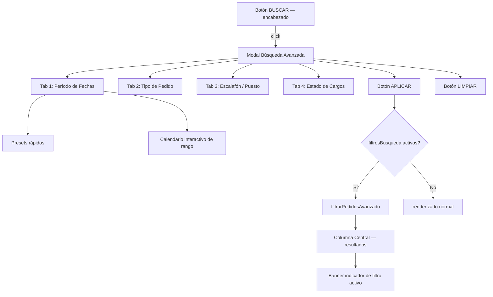
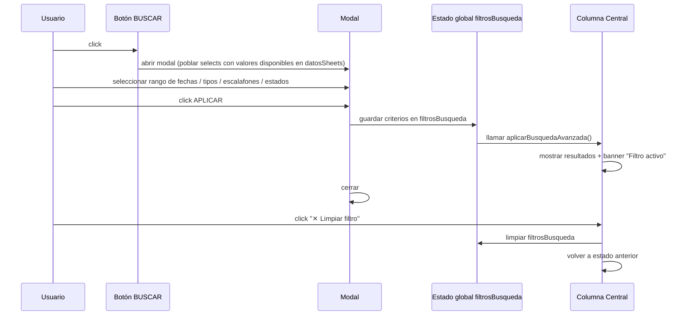

# Design Document: Panel de Búsqueda Avanzada

## Overview

Se agrega un botón "BUSCAR" en el extremo derecho del encabezado superior que abre un modal de búsqueda avanzada con múltiples solapas (tabs). Cada solapa representa una dimensión de filtrado independiente; los filtros de todas las solapas activas se combinan con lógica AND para determinar qué pedidos de obra se muestran en la columna central. El panel opera sobre el objeto global `datosSheets` sin modificarlo, y coexiste con los filtros de estado existentes (ACTIVOS / DESPRIORIZADOS / RESUELTOS).

La búsqueda puede ejecutarse desde cualquier punto de la app:  
- Si hay un hospital seleccionado, filtra los pedidos del hospital actualmente visible.  
- Si no hay hospital seleccionado, activa un modo "búsqueda global" que muestra resultados de todos los hospitales en la columna central.

---

## Arquitectura



---

## Flujo de interacción principal



---

## Componentes y sus interfaces

### Componente: Botón de acceso

**Ubicación**: `.encabezado-superior`, extremo derecho (flex + margin-left auto).  
**Aspecto**: mismo estilo que `.btn-inicio-texto` pero con ícono 🔍 y texto "BUSCAR".

```
interface BotonBuscar {
  posicion: "extremo derecho del encabezado"
  estiloBase: mismoEstiloQueBtnInicioTexto
  onclick: () => abrirModalBusqueda()
}
```

---

### Componente: Modal de Búsqueda Avanzada

**Estructura DOM**:

```
div#modal-busqueda.modal-overlay
  └── div.modal-busqueda-contenido          (panel central, ancho ~600px)
        ├── h2                              "BÚSQUEDA AVANZADA"
        ├── div.tabs-busqueda               (barra de solapas)
        │     ├── button.tab-btn[data-tab="fechas"]     "📅 Período"
        │     ├── button.tab-btn[data-tab="tipo"]       "📋 Tipo de Pedido"
        │     ├── button.tab-btn[data-tab="escalafon"]  "👤 Escalafón / Puesto"
        │     └── button.tab-btn[data-tab="estado"]     "🔖 Estado de Cargos"
        ├── div.tab-panel#tab-fechas        (visible por defecto)
        ├── div.tab-panel#tab-tipo          (oculto)
        ├── div.tab-panel#tab-escalafon     (oculto)
        ├── div.tab-panel#tab-estado        (oculto)
        └── div.modal-busqueda-footer
              ├── button#btn-limpiar-busq   "LIMPIAR"
              └── button#btn-aplicar-busq   "APLICAR FILTRO"
```

---

### Componente: Tab 1 — Período de Fechas

**Propósito**: Filtrar pedidos cuya `fecha` cae dentro de un rango [desde, hasta].

**Presets rápidos** (chips clicables que pre-rellenan el rango a partir de hoy):

| Preset      | Lógica                          |
|-------------|----------------------------------|
| Bimestre    | hoy → hoy + 2 meses              |
| Trimestre   | hoy → hoy + 3 meses              |
| Cuatrimestre| hoy → hoy + 4 meses              |
| Semestre    | hoy → hoy + 6 meses              |
| Año         | hoy → hoy + 12 meses             |

**Calendario interactivo de rango**:  
- Muestra un calendario mensual navegable (mes anterior / mes siguiente).  
- Primer clic: marca fecha de inicio.  
- Segundo clic: marca fecha de fin. Si es anterior al inicio, los intercambia.  
- Arrastrar (mousedown → mouseup) también selecciona un rango.  
- Días seleccionados se pintan con fondo `#8de2d6` (celeste), extremos con fondo `#153244` (azul oscuro).

**Consideraciones sobre datos parciales**:

| Valor de `fecha`          | Tratamiento                                          |
|---------------------------|------------------------------------------------------|
| `"-"`                     | Se considera **sin fecha** — queda fuera del filtro  |
| `"2026"` (solo año)       | Se interpreta como `2026-01-01` a `2026-12-31`       |
| `"2026-09-01 00:00:00"`   | Se parsea normalmente como fecha completa            |

---

### Componente: Tab 2 — Tipo de Pedido

**Propósito**: Mostrar solo pedidos de uno o varios tipos (Obra, Ampliacion de dotación, Obra Recorrida FQ, Ampliacion Recorrida FQ, y cualquier tipo futuro que exista en `catalogos.tiposPedido`).

**UI**: Lista de checkboxes generados dinámicamente desde `catalogos.tiposPedido` al abrir el modal. Todos marcados por defecto (= sin restricción).

**Lógica**: Un pedido pasa el filtro si su `tipo` está incluido en el conjunto de tipos seleccionados.

---

### Componente: Tab 3 — Escalafón / Puesto

**Propósito**: Encontrar pedidos que contengan al menos un cargo con determinado escalafón y/o puesto específico.

**UI**:
- Select múltiple (o lista de checkboxes) de escalafones, generado desde `catalogos.escalafones`.
- Input de texto libre "Puesto contiene..." para búsqueda parcial por puesto.
- Modo combinación: AND (el cargo debe cumplir ambas condiciones) o OR (basta con una).

**Lógica**: Un pedido pasa el filtro si al menos uno de sus `cargos[]` satisface:
- `cargo.escalafon` ∈ escalafones seleccionados (o ninguno seleccionado = todos)  
- `cargo.puesto.toLowerCase().includes(textoPuesto)` (o texto vacío = todos)

---

### Componente: Tab 4 — Estado de Cargos

**Propósito**: Filtrar pedidos según el estado agregado de sus cargos (validados, aprobados con Q > 0, pendientes de expediente).

**Opciones disponibles** (checkboxes múltiples):

| Opción                        | Condición evaluada sobre `cargos[]`                          |
|-------------------------------|--------------------------------------------------------------|
| Con al menos 1 cargo validado | `cargos.some(c => c.validado === true)`                      |
| Con todos los cargos validados| `cargos.every(c => c.validado === true)`                     |
| Con Q aprobado > 0            | `cargos.some(c => c.qAprobado > 0)`                          |
| Sin expediente cargado        | `cargos.some(c => !c.expediente \|\| c.expediente === '-')`   |
| Con cargos pendientes (no resueltos) | `cargos.some(c => !c.resuelto)`                       |

**Lógica**: El pedido pasa si satisface **todas** las opciones marcadas (AND entre opciones).

---

## Modelos de datos del panel

### Estado global `filtrosBusqueda`

```javascript
// Objeto de estado global que se inicializa vacío (sin restricciones)
filtrosBusqueda = {
  activo: false,          // true cuando hay al menos un criterio aplicado
  fechaDesde: null,       // Date | null
  fechaHasta: null,       // Date | null
  tiposSeleccionados: [], // string[] — vacío = todos
  escalafonesSeleccionados: [], // string[] — vacío = todos
  textoPuesto: "",        // string
  estadosCargo: {         // cada flag en true = ese filtro está activo
    alMenosUnoValidado: false,
    todosValidados: false,
    qAprobadoMayorCero: false,
    sinExpediente: false,
    conPendientes: false
  },
  modoGlobal: false       // true si no hay hospital seleccionado al aplicar
}
```

---

## Lógica de filtrado — Pseudocódigo formal

### Función principal: parsearFecha

```pascal
FUNCTION parsearFecha(valorFecha)
  INPUT: valorFecha : String
  OUTPUT: resultado : { desde: Date, hasta: Date } | null

  IF valorFecha = null OR valorFecha = "-" OR valorFecha = "" THEN
    RETURN null
  END IF

  // Solo año
  IF valorFecha MATCHES /^\d{4}$/ THEN
    anio ← parseInt(valorFecha)
    RETURN { desde: new Date(anio, 0, 1), hasta: new Date(anio, 11, 31) }
  END IF

  // Fecha completa con hora
  fecha ← new Date(valorFecha)
  IF isNaN(fecha) THEN
    RETURN null
  END IF

  RETURN { desde: fecha, hasta: fecha }
END FUNCTION
```

**Precondiciones**: `valorFecha` es string o null/undefined.  
**Postcondiciones**: Retorna objeto con `desde` y `hasta` (del mismo día si es fecha completa), o null si el valor no es interpretable.  
**Loop invariants**: N/A (no hay bucles).

---

### Función principal: pedidoPasaFiltroFechas

```pascal
FUNCTION pedidoPasaFiltroFechas(pedido, fechaDesde, fechaHasta)
  INPUT:
    pedido     : { fecha: String, ... }
    fechaDesde : Date | null
    fechaHasta : Date | null
  OUTPUT: Boolean

  // Sin restricción de fechas
  IF fechaDesde = null AND fechaHasta = null THEN
    RETURN true
  END IF

  rango ← parsearFecha(pedido.fecha)

  IF rango = null THEN
    RETURN false    // pedidos sin fecha quedan excluidos al aplicar filtro de fechas
  END IF

  // Hay solapamiento entre [rango.desde, rango.hasta] y [fechaDesde, fechaHasta]
  IF rango.hasta >= fechaDesde AND rango.desde <= fechaHasta THEN
    RETURN true
  ELSE
    RETURN false
  END IF
END FUNCTION
```

**Precondiciones**: `fechaDesde` ≤ `fechaHasta` si ambas no son null.  
**Postcondiciones**: Retorna true si y sólo si existe solapamiento entre el período del pedido y el rango filtrado.

---

### Función principal: pedidoPasaFiltroTipo

```pascal
FUNCTION pedidoPasaFiltroTipo(pedido, tiposSeleccionados)
  INPUT:
    pedido             : { tipo: String, ... }
    tiposSeleccionados : String[]
  OUTPUT: Boolean

  IF tiposSeleccionados.length = 0 THEN
    RETURN true
  END IF

  RETURN tiposSeleccionados.includes(pedido.tipo)
END FUNCTION
```

---

### Función principal: pedidoPasaFiltroEscalafon

```pascal
FUNCTION pedidoPasaFiltroEscalafon(pedido, escalafonesSeleccionados, textoPuesto)
  INPUT:
    pedido                   : { cargos: Cargo[] }
    escalafonesSeleccionados : String[]
    textoPuesto              : String
  OUTPUT: Boolean

  sinFiltroEscalafon ← escalafonesSeleccionados.length = 0
  sinFiltroPuesto    ← textoPuesto.trim() = ""

  IF sinFiltroEscalafon AND sinFiltroPuesto THEN
    RETURN true
  END IF

  FOR EACH cargo IN pedido.cargos DO
    cumpleEscalafon ← sinFiltroEscalafon OR escalafonesSeleccionados.includes(cargo.escalafon)
    cumplePuesto    ← sinFiltroPuesto OR cargo.puesto.toLowerCase().includes(textoPuesto.toLowerCase().trim())

    IF cumpleEscalafon AND cumplePuesto THEN
      RETURN true
    END IF
  END FOR

  RETURN false
END FUNCTION
```

**Loop invariant**: En cada iteración, ningún cargo procesado anteriormente satisfizo ambas condiciones simultáneamente.

---

### Función principal: pedidoPasaFiltroEstadoCargos

```pascal
FUNCTION pedidoPasaFiltroEstadoCargos(pedido, estadosCargo)
  INPUT:
    pedido       : { cargos: Cargo[] }
    estadosCargo : { alMenosUnoValidado, todosValidados, qAprobadoMayorCero,
                     sinExpediente, conPendientes } : Boolean flags
  OUTPUT: Boolean

  IF NOT (estadosCargo.alMenosUnoValidado OR estadosCargo.todosValidados
          OR estadosCargo.qAprobadoMayorCero OR estadosCargo.sinExpediente
          OR estadosCargo.conPendientes) THEN
    RETURN true   // ningún filtro de estado activo
  END IF

  IF estadosCargo.alMenosUnoValidado THEN
    IF NOT pedido.cargos.some(c => c.validado) THEN RETURN false END IF
  END IF

  IF estadosCargo.todosValidados THEN
    IF NOT pedido.cargos.every(c => c.validado) THEN RETURN false END IF
  END IF

  IF estadosCargo.qAprobadoMayorCero THEN
    IF NOT pedido.cargos.some(c => c.qAprobado > 0) THEN RETURN false END IF
  END IF

  IF estadosCargo.sinExpediente THEN
    IF NOT pedido.cargos.some(c => !c.expediente OR c.expediente = "-") THEN RETURN false END IF
  END IF

  IF estadosCargo.conPendientes THEN
    IF NOT pedido.cargos.some(c => !c.resuelto) THEN RETURN false END IF
  END IF

  RETURN true
END FUNCTION
```

---

### Función principal: aplicarBusquedaAvanzada

```pascal
PROCEDURE aplicarBusquedaAvanzada()
  // Leer valores del modal y guardar en filtrosBusqueda
  filtrosBusqueda.fechaDesde         ← leerFechaDesdeModal()
  filtrosBusqueda.fechaHasta         ← leerFechaHastaModal()
  filtrosBusqueda.tiposSeleccionados ← leerTiposSeleccionados()
  filtrosBusqueda.escalafonesSeleccionados ← leerEscalafonesSeleccionados()
  filtrosBusqueda.textoPuesto        ← leerTextoPuesto()
  filtrosBusqueda.estadosCargo       ← leerEstadosCargo()
  filtrosBusqueda.activo             ← hayCriteriosActivos(filtrosBusqueda)
  filtrosBusqueda.modoGlobal         ← (hospitalActual = "")

  cerrarModalBusqueda()

  IF filtrosBusqueda.modoGlobal THEN
    mostrarResultadosGlobales()
  ELSE
    entrarHospital(hospitalActual)   // re-renderiza con filtros activos
  END IF
END PROCEDURE
```

---

### Función principal: obtenerPedidosFiltrados (hook en renderizado)

```pascal
FUNCTION pedidoPasaTodosLosFiltros(pedido)
  INPUT:  pedido : Pedido
  OUTPUT: Boolean

  IF NOT filtrosBusqueda.activo THEN
    RETURN true
  END IF

  RETURN pedidoPasaFiltroFechas(pedido, filtrosBusqueda.fechaDesde, filtrosBusqueda.fechaHasta)
     AND pedidoPasaFiltroTipo(pedido, filtrosBusqueda.tiposSeleccionados)
     AND pedidoPasaFiltroEscalafon(pedido, filtrosBusqueda.escalafonesSeleccionados, filtrosBusqueda.textoPuesto)
     AND pedidoPasaFiltroEstadoCargos(pedido, filtrosBusqueda.estadosCargo)
END FUNCTION
```

Esta función se inserta en `entrarHospital()` justo antes de renderizar cada cajón, después de la evaluación de `filtrosActivos` (estado ACTIVOS/DESPRIORIZADOS/RESUELTOS). Ambos sistemas de filtrado operan en serie: primero el filtro de estado existente, luego `pedidoPasaTodosLosFiltros`.

---

### Función principal: mostrarResultadosGlobales

```pascal
PROCEDURE mostrarResultadosGlobales()
  // Modo búsqueda global: sin hospital seleccionado
  grilla ← document.getElementById('grilla-pedidos')
  grilla.innerHTML ← ""
  grilla.style.display ← "flex"
  document.getElementById('cabecera').style.display ← "block"
  document.getElementById('titulo-hospital').innerText ← "Resultados de búsqueda"
  document.getElementById('barra-filtros').style.display ← "none"

  FOR EACH (hospital, pedidos) IN datosSheets DO
    FOR EACH (pedido, indexObra) IN pedidos DO
      IF pedidoPasaTodosLosFiltros(pedido) THEN
        renderizarCajon(hospital, pedido, indexObra, modoGlobal: true)
          // El cajón en modo global agrega una etiqueta extra con el nombre del hospital
      END IF
    END FOR
  END FOR

  IF grilla.children.length = 0 THEN
    grilla.innerHTML ← "<p style='color:#888'>Sin resultados para los criterios seleccionados.</p>"
  END IF
END PROCEDURE
```

---

### Función principal: limpiarBusqueda

```pascal
PROCEDURE limpiarBusqueda()
  filtrosBusqueda ← { activo: false, fechaDesde: null, fechaHasta: null,
                       tiposSeleccionados: [], escalafonesSeleccionados: [],
                       textoPuesto: "", estadosCargo: { todos false }, modoGlobal: false }

  ocultarBannerFiltro()

  IF hospitalActual ≠ "" THEN
    entrarHospital(hospitalActual)
  ELSE
    salirHospital()
  END IF
END PROCEDURE
```

---

## Algoritmo del calendario interactivo

```pascal
// Estado local del calendario (variables de módulo dentro del modal)
estadoCal = {
  mesVisible: Date (primer día del mes actual),
  fechaInicio: Date | null,
  fechaFin:    Date | null,
  arrastrando: false
}

PROCEDURE renderizarCalendario()
  // Genera la grilla del mes visible
  primerDia ← new Date(estadoCal.mesVisible.getFullYear(),
                        estadoCal.mesVisible.getMonth(), 1)
  ultimoDia ← new Date(primerDia.getFullYear(), primerDia.getMonth() + 1, 0)
  diasOffset ← primerDia.getDay()   // 0=Dom, ajustar a lunes si se desea

  celdas ← []
  FOR i FROM 1 TO (diasOffset + ultimoDia.getDate()) DO
    IF i <= diasOffset THEN
      celdas.push(null)  // celda vacía
    ELSE
      dia ← new Date(primerDia.getFullYear(), primerDia.getMonth(), i - diasOffset)
      celdas.push(dia)
    END IF
  END FOR

  // Renderizar HTML de la grilla con clases según si cada día cae en el rango
  FOR EACH dia IN celdas DO
    IF dia = null THEN
      renderCeldaVacia()
    ELSE
      clase ← calcularClaseDia(dia, estadoCal.fechaInicio, estadoCal.fechaFin)
      renderCeldaDia(dia, clase)
    END IF
  END FOR
END PROCEDURE

FUNCTION calcularClaseDia(dia, inicio, fin)
  IF dia = inicio OR dia = fin THEN
    RETURN "cal-extremo"    // fondo #153244, texto blanco
  ELSE IF inicio ≠ null AND fin ≠ null AND dia > inicio AND dia < fin THEN
    RETURN "cal-rango"      // fondo #8de2d6
  ELSE
    RETURN "cal-dia"        // sin relleno
  END IF
END FUNCTION

PROCEDURE onClickDia(dia)
  IF estadoCal.fechaInicio = null OR (estadoCal.fechaInicio ≠ null AND estadoCal.fechaFin ≠ null) THEN
    // Primer clic o reinicio de selección
    estadoCal.fechaInicio ← dia
    estadoCal.fechaFin    ← null
  ELSE
    // Segundo clic — establecer fin
    IF dia < estadoCal.fechaInicio THEN
      estadoCal.fechaFin   ← estadoCal.fechaInicio
      estadoCal.fechaInicio ← dia
    ELSE
      estadoCal.fechaFin ← dia
    END IF
    // Actualizar inputs de texto con las fechas seleccionadas
    sincronizarInputsConCal()
  END IF
  renderizarCalendario()
END PROCEDURE
```

**Loop invariant** en `renderizarCalendario`: En cada iteración `i`, todas las celdas anteriores ya fueron clasificadas y pintadas correctamente.

---

## Banner de filtro activo

Cuando `filtrosBusqueda.activo = true`, se muestra un banner visible por debajo del encabezado del hospital (o de "Resultados de búsqueda") con la descripción legible del filtro activo y un botón `✕ Limpiar filtro`.

```
div#banner-filtro-activo   (position: relative, fondo amarillo #ffcc00, color #153244)
  ├── span  "🔍 Filtro activo: [descripción textual de los criterios]"
  └── button "✕ Limpiar"  → onclick: limpiarBusqueda()
```

La descripción se construye con:

```pascal
FUNCTION describirFiltroActivo(fb)
  partes ← []
  IF fb.fechaDesde THEN
    partes.push("Período: " + formatearFecha(fb.fechaDesde) + " – " + formatearFecha(fb.fechaHasta))
  END IF
  IF fb.tiposSeleccionados.length > 0 THEN
    partes.push("Tipos: " + fb.tiposSeleccionados.join(", "))
  END IF
  IF fb.escalafonesSeleccionados.length > 0 OR fb.textoPuesto ≠ "" THEN
    partes.push("Escalafón/Puesto: criterios activos")
  END IF
  IF hayAlgunEstadoCargo(fb.estadosCargo) THEN
    partes.push("Estado de cargos: criterios activos")
  END IF
  RETURN partes.join(" · ")
END FUNCTION
```

---

## Consideraciones de diseño visual

- El modal usa el mismo `modal-overlay` existente. El panel interior tiene `max-width: 620px`, `min-height: 420px`, se adapta al contenido (sin altura fija).
- Tabs con estilo consistente: fondo `#e8ecef` inactivo, fondo `#153244` + texto blanco activo.
- Presets de fechas: chips con borde `#153244`, hover con fondo `#8de2d6`.
- El calendario usa una grilla CSS de 7 columnas (`display: grid; grid-template-columns: repeat(7, 1fr)`).
- Días del rango: fondo `rgba(141, 226, 214, 0.4)` (celeste traslúcido). Extremos: fondo `#153244`, texto blanco, `border-radius: 50%`.
- En mobile (`max-width: 768px`): el modal ocupa el 95% del ancho, el calendario se reduce y los presets se reorganizan en 2 columnas.

---

## Testing strategy

### Unit testing approach

Funciones candidatas a tests unitarios:
- `parsearFecha()` — probar los tres formatos de entrada (`"-"`, solo año, fecha completa) y entradas inválidas.
- `pedidoPasaFiltroFechas()` — probar solapamiento, no solapamiento, y casos con `null`.
- `pedidoPasaFiltroTipo()` — lista vacía (pasa todo), lista con valores, tipo no coincidente.
- `pedidoPasaFiltroEscalafon()` — cargo con match de escalafón, con match de puesto, sin match.
- `pedidoPasaFiltroEstadoCargos()` — combinaciones de flags.

### Property-based testing approach

**PBT Library**: fast-check (se puede incluir vía CDN en ambiente de prueba separado).

Propiedades clave:
1. `∀ pedido: parsearFecha("-") = null` siempre.
2. `∀ fechaDesde, fechaHasta: si fechaDesde ≤ fecha del pedido ≤ fechaHasta → pedidoPasaFiltroFechas = true`.
3. `∀ filtro vacío: pedidoPasaTodosLosFiltros(pedido) = true` para cualquier pedido.
4. `∀ pedido: si filtrosBusqueda.activo = false → pedidoPasaTodosLosFiltros = true`.

### Integration testing approach

Verificar manualmente (o con Playwright en un entorno separado):
- Aplicar filtro por fechas + tipo y confirmar que solo los cajones correspondientes aparecen.
- Limpiar filtro y confirmar que vuelve el estado anterior exacto.
- Búsqueda global (sin hospital seleccionado) muestra resultados de todos los hospitales.
- Los filtros de estado existentes (ACTIVOS/DESPRIORIZADOS/RESUELTOS) siguen funcionando independientemente del filtro avanzado.

---

## Dependencies

- Sin dependencias externas nuevas. El calendario se implementa en JS vanilla con CSS Grid.
- Reutiliza `catalogos.tiposPedido`, `catalogos.escalafones` ya disponibles en el estado global.
- El modal reutiliza los estilos `.modal-overlay` y `.cajon-pedido` existentes.
